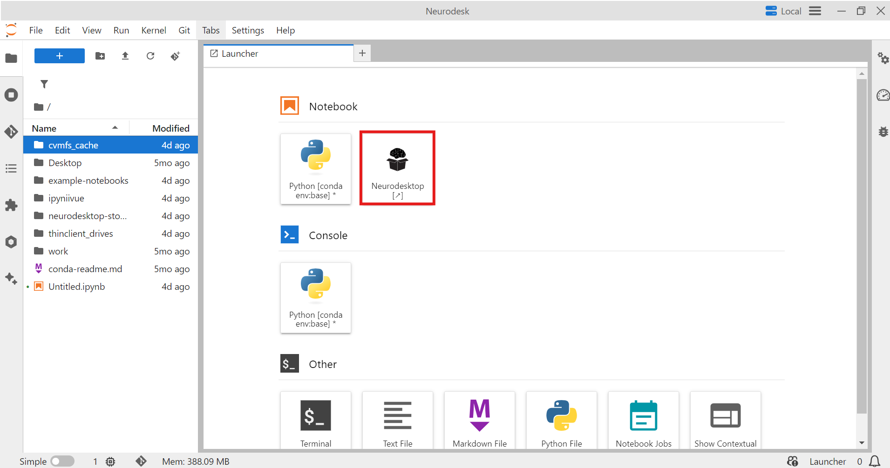
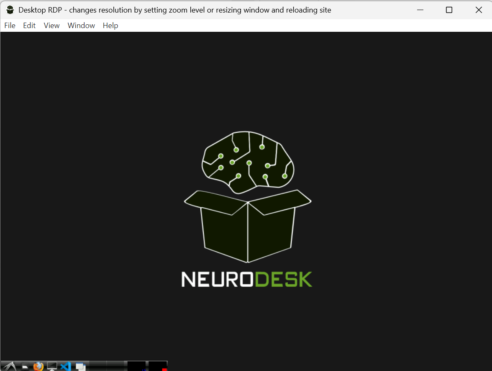
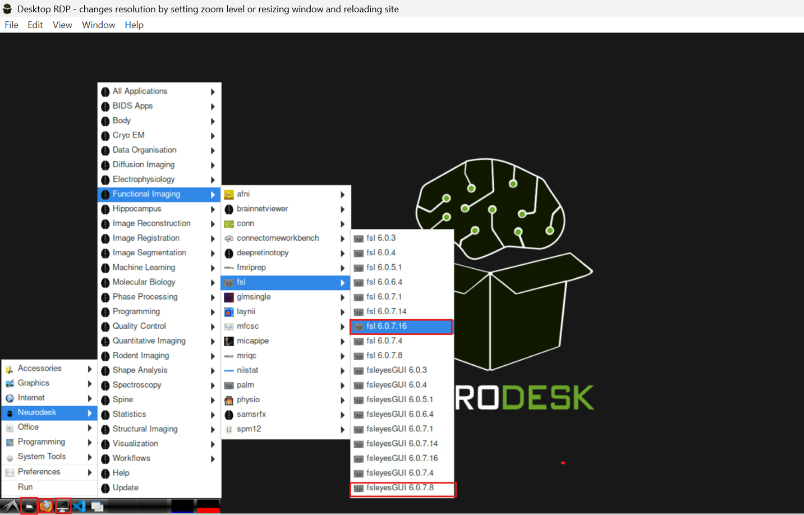
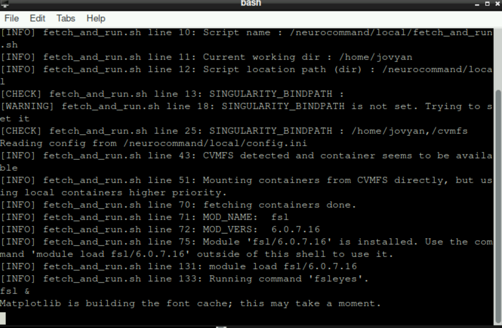
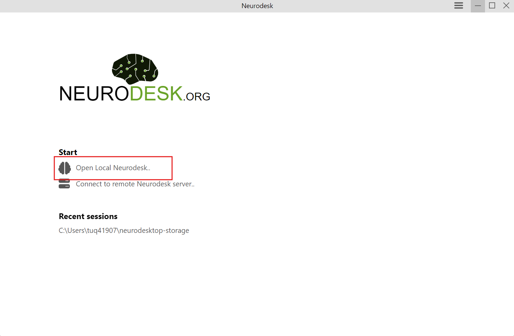
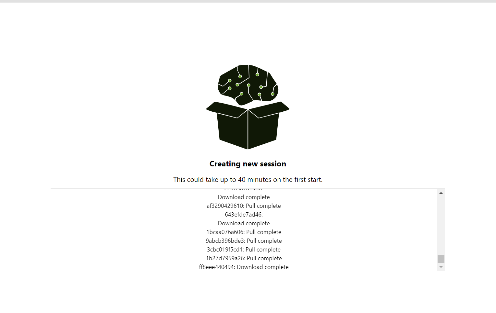

# Lab 0: Getting Started with Neurodesk (Browser + Optional Local Install)

Throughout these lab tutorials, we will use **Neurodesk**, a neuroimaging computing platform that makes analyses more **reproducible** and **portable** by running tools in standardized environments (containers).

For this course, **most students should use Neurodesk in a web browser** (Neurodesk Play or Neurodesk EDU). Installing Neurodesk locally is optional.

---

## Recommended options (choose ONE)

### Option A (available to everyone): Neurodesk Play (browser)
Open: **https://play.neurodesk.org/**

This option works in any modern browser. It is ideal for learning and short analyses.
Keep in mind that Neurodesk Play has resource limits and stored files may be deleted after ~30 days.

### Option B (preferred for this course): Neurodesk EDU (browser)
Open: **https://edu.neurodesk.org/**

You will get access after you send your **GitHub username** to the instructor.

Compared to Play, the EDU hub provides more storage and compute, which makes it easier to run real preprocessing workflows.

### Option C (optional): Install Neurodesk locally
If you *want* to run Neurodesk on your own computer (Mac/Windows/Linux), you can install **Docker + Neurodesk App**.
This is optional and not required for the course.

---

## Where to save files (important)

Inside Neurodesktop, save course files in the **Storage** location (often shown as a “Storage” folder on the desktop).
This is the safest place to keep your data and outputs organized.

**Avoid saving large datasets in random locations**, especially in `/home/...`, because those locations can have strict storage limits in hosted systems.

---

# Setup (Browser: Play or EDU)

These steps apply to **both Neurodesk Play and Neurodesk EDU**.

## Step 1 — Launch Neurodesktop
1. Log in with your GitHub account.
2. Launch **Neurodesktop**.
3. Choose **Desktop VNC** or **Desktop RDP** (either is fine).

> Screenshot references (if available in your repo):
>
>   
> 

Once it loads, you will see a full Linux desktop in your browser.

## Step 2 — Understand the key icons (what you will use most)
From left to right, you will commonly use:
- **File browser** (to navigate folders)
- **Firefox** (browser)
- **Base terminal** (general commands like `git`, `pip`, `datalad`)
- **FSL / FSLeyes** (FSL-specific tools)

> 

## Step 3 — Open the FSL terminal (for FSL commands only)
1. Click the **FSL** icon (the most recent version).
2. The first launch may take a few minutes.

> 

When you see a message like **“module fslXXX is installed”**, you can run FSL commands in this terminal (e.g., `fsleyes`).

### Important: Base terminal vs FSL terminal
Neurodesk runs many tools in **separate containers**, so the terminals do **not** share the same environment.

- Use the **base terminal** for general tools (e.g., `git`, `python`, `pip`, `datalad`).
- Use the **FSL terminal** for FSL commands (e.g., `fsleyes`, `fslmaths`, `bet`, `feat`).

If a command “doesn’t exist,” you are probably in the wrong terminal.

> Example screenshot:
>
> 

## Step 4 — Install DataLad (very rare)
Not sure if this is a real problem, but during testing, we think we observed a case where `datalad` didn't work "out of the box", but I don't think that was reproduced. However, if you encounter that issue, tell the instructor/TA and use this workaround. 

Open a **base terminal**, then run:

```bash
python -m pip install --user datalad
```

This installs DataLad for downloading datasets (e.g., from OpenNeuro).

> Screenshot reference:
>
> 

---

# Optional setup (Local install on your computer)

If you are installing Neurodesk locally, follow these steps.

## Hardware requirements (local install)
- Docker requires virtualization support and enough resources for both your host OS and the container environment.
- **At least ~5 GB** free space for the base image.
- Recommended for learning & moderate use:
  - **4–8 CPU cores**
  - **16–32 GB RAM** (8 GB can work but will be slow)
  - SSD with **~50–100 GB free space**

## Local installation steps
1. Download and install **Docker** and **Neurodesk App**:  
   https://iishiishii.github.io/neurodesk.github.io/getting-started/local/neurodeskapp/
2. Open Docker and wait for it to finish starting.
3. Open Neurodesk App and click **“Open Local Neurodesk.”**

> 

The very first launch may take a while while the environment is built.
Stay connected to the internet and wait until it finishes.

> 

---

# Troubleshooting

## 1) Missing / outdated `git-annex` (DataLad download errors)
Sometimes DataLad complains that `git-annex` is missing or too old.
If that happens, run the following **in the base terminal**:

```bash
wget https://downloads.kitenet.net/git-annex/linux/current/git-annex-standalone-amd64.tar.gz
tar -xzf git-annex-standalone-amd64.tar.gz
export PATH=$PWD/git-annex.linux:$PATH
```

Then confirm:
```bash
git-annex version
```

After that, retry your DataLad command.

## 2) “Command not found” in an app terminal
Remember: app terminals are isolated.
If you installed something in the **base terminal**, it will not necessarily appear in the **FSL terminal** (and vice versa).

When in doubt:
- **General tools** → base terminal
- **FSL tools** → FSL terminal

## 3) Viewing HTML reports (fMRIPrep, etc.)
Some HTML outputs (especially reports that rely on JavaScript and animations, like the **fMRIPrep** report) may not render correctly when opened directly from within the Neurodesktop graphical environment. In those cases, open the HTML report through the **Jupyter Notebook/Lab interface**, which serves the file in a normal browser tab.

**General process**
1. Leave Neurodesktop running, but switch back to your Neurodesk **hub** page in the browser (Play or EDU).
2. Launch **Jupyter** (Jupyter Notebook or JupyterLab) from the hub.
3. In Jupyter’s file browser, navigate to the folder where you saved your outputs (ideally the **Storage** folder).
4. Locate the report (for fMRIPrep, look for a file like `sub-*.html` inside your fMRIPrep output directory).
5. Open the HTML in a browser-rendered view:
   - If clicking the file renders the report, you are done.
   - If it opens as raw HTML text, use the file’s context menu to **open in a new browser tab** (or download it and open it in Firefox/Chrome).

**Tip:** If the report uses pop-ups or embedded content, your browser may block parts of it. If something looks “blank,” try allowing pop-ups for the Neurodesk domain and reload the page.

---

# Looking ahead: FreeSurfer license (for later preprocessing)
Some pipelines (including **fMRIPrep**) require a FreeSurfer license file.
For this course, we will assume the license file is located at:

- `~/.license`

If you do not have this file yet, we will cover it before running fMRIPrep.
