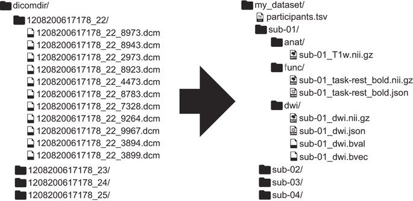
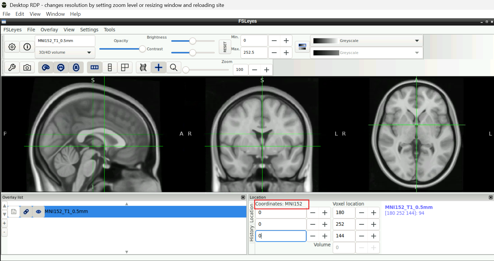
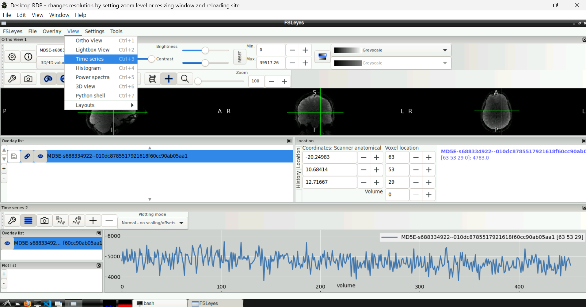
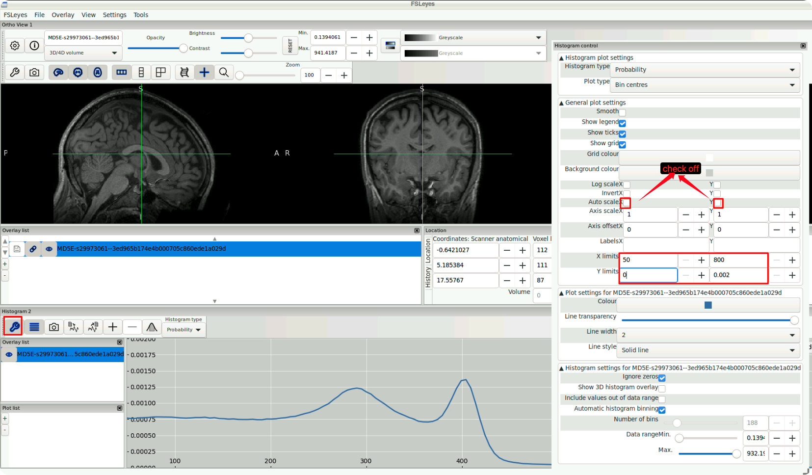
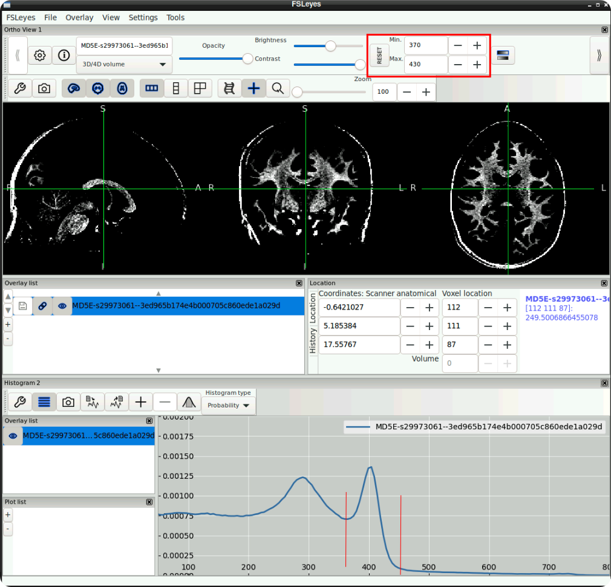
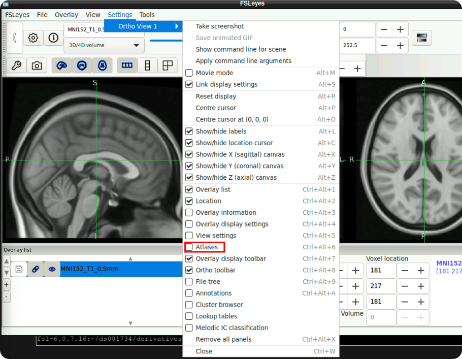
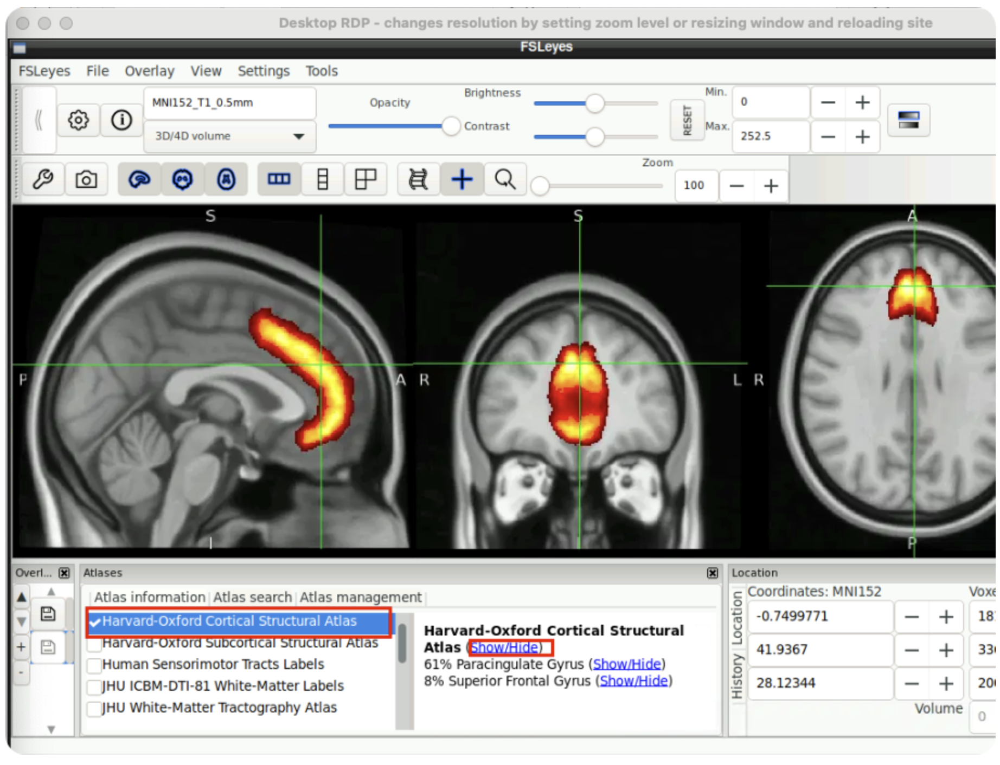
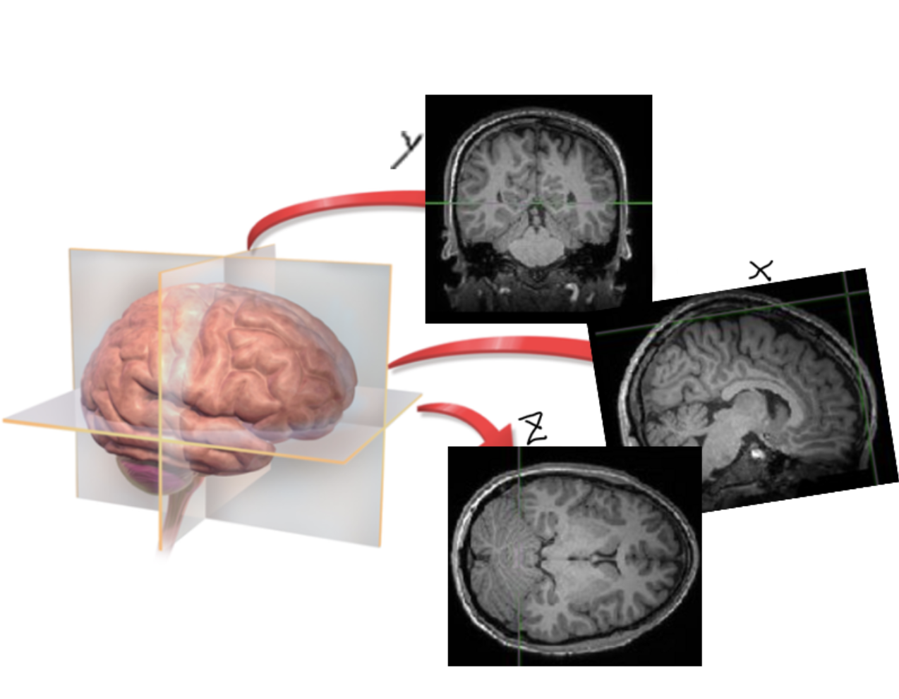

# Lab 1: Exploring Brain Anatomy

## Learning objectives
This lab will help you get comfortable **loading, viewing, and describing MRI/fMRI data**. By the end, you should be able to:

- Load and view anatomical (3D) and functional (4D) MRI data in **fsleyes**
- Describe key differences between anatomical vs. functional images (resolution, contrast, noise)
- Estimate basic properties of the adult human brain (dimensions and approximate volume)
- Explain (at a basic level) how **gray matter** differs from **white matter**
- Identify several major anatomical structures using MNI space and an atlas

---

## Introduction
The human brain is incredibly complex. Although it weighs only about **3 pounds (≈1.3 kg)**, it contains ~100 billion neurons, plus several times as many supporting cells.

MRI cannot resolve individual neurons (they are on the order of micrometers), but it *can* tell us a great deal about brain anatomy and physiology at the scale of **millimeters to centimeters**. In this lab, you’ll learn what MRI data “look like,” how to navigate them, and how to start making basic measurements and interpretations from the images.

---

## Data organization


**All datasets in this course follow the Brain Imaging Data Structure (BIDS) standard:**  
https://bids.neuroimaging.io/

BIDS makes files and folders easier to navigate. Each subject is in a folder like `sub-XXX`, and the main subfolders include:

- `anat/` for 3D anatomical scans (e.g., T1w, T2w)
- `func/` for 4D functional scans (BOLD data over time)

Each NIfTI image (`.nii` or `.nii.gz`) is typically paired with a JSON file containing scan metadata.

---

# 1) Viewing MRI data in fsleyes

In this lab you will view two types of MRI data:

- **Anatomical images (3D):** high-resolution structure (e.g., T1w, T2w)
- **Functional images (4D):** lower resolution, measured repeatedly over time (BOLD contrast)

You will use **fsleyes** (part of FSL) to view data in 3D or 4D, and to overlay images.

---

## 1.1 Download the data

In the **base terminal** in Neurodesk, download two OpenNeuro datasets with `datalad`.

```bash
# NARPS dataset (Poldrack/Schonberg)
datalad install https://github.com/OpenNeuroDatasets/ds001734.git
cd ds001734
datalad get sub-001
datalad get ~/ds001734/derivatives/fmriprep/sub-001/anat/sub-001_T1w_preproc.nii.gz

# go back to your home directory
cd ~

# SRNDNA dataset (Fareri/Smith)
datalad install https://github.com/OpenNeuroDatasets/ds003745.git
cd ds003745
datalad get sub-104
datalad get sub-137
```

---

## 1.2 Open the data in fsleyes

**Option A (recommended): use the FSL terminal**
- Open the **FSL** terminal in Neurodesk and run the commands below.
- Each `&` opens the viewer in the background so you can open multiple windows.

```bash
fsleyes ~/ds001734/derivatives/fmriprep/sub-001/anat/sub-001_T1w_preproc.nii.gz &

fsleyes ~/ds001734/sub-001/func/sub-001_task-MGT_run-01_bold.nii.gz &

fsleyes ~/ds003745/sub-104/anat/sub-104_T1w.nii.gz &

fsleyes ~/ds003745/sub-104/anat/sub-104_T2w.nii.gz &
# & opens windows in the background so you can keep using the terminal
```

Optional (also explore sub-137):

```bash
fsleyes ~/ds003745/sub-137/anat/sub-137_T1w.nii.gz &
fsleyes ~/ds003745/sub-137/anat/sub-137_T2w.nii.gz &
```

**Option B: load FSL tools from the base terminal**
If you are *not* using the FSL terminal, you can usually load the FSL environment first (depending on your setup):

```bash
ml fsl
```

Then run the same `fsleyes ...` commands.

---

## 1.3 Compare what you see

Display each dataset in its own window.

**Q1. T1 vs. T2 (sub-104):** What features look *the same* across T1 and T2?  
(Think: major structures, symmetry, overall anatomy.)

**Q2. T1 vs. T2 (sub-104):** What features look *different*, and why?  
(Think: contrast—what is bright vs. dark, and what tissue types those differences reveal.)

Optional (for in-class discussion): sub-104 and sub-137 differ noticeably. One participant is significantly older than the other.  
What visual evidence would you use to justify your guess?

---

# 2) Navigating anatomy in a standard template

Now open a standardized template brain in MNI space:

```bash
# if you're working through the FSL terminal:
fsleyes /opt/fsl-6.0.7.16/data/standard/MNI152_T1_0.5mm.nii.gz &

# alternatively, if you're working with fsl loaded in your base terminal:
# << actually, this doesn't seem to be an option for this specific usecase >>

```



### Key idea
MRI volumes have 3 spatial dimensions: **X (left–right), Y (posterior–anterior), Z (inferior–superior)**.  
Functional MRI adds a 4th dimension: **time**.

Use your mouse or the coordinate fields in fsleyes to move through the brain.

---

# 3) Functional MRI is time-series data

Functional data are 4D: the scanner repeatedly samples the same brain volume over time.

Open the functional dataset window:

`sub-001_task-MGT_run-01_bold.nii.gz`

Then:  
**Click any voxel inside the brain → View → Time series**

A plot will appear showing signal intensity over time for that voxel.



**Q3.** Click 3–5 very different locations (gray matter, white matter, near edges of brain, etc.).  
What differences do you notice in the time series patterns?  
(Think: stability, noise, slow drifts, spikes, plausible artifacts.)

---

# 4) Measuring the brain

MRI can be used to quantify brain structure (e.g., volume differences across individuals).

In your terminal, use `fslstats` to estimate the volume of the anatomical scan:

```bash
fslstats ~/ds001734/derivatives/fmriprep/sub-001/anat/sub-001_T1w_preproc.nii.gz -V
```

This returns two values:
1) number of **nonzero** voxels  
2) total volume (in mm³)

Before you run it, check what the command does. Note that most programs in FSL will tell you how to use them if you just enter them into the command line like below.

```bash
fslstats
```

**Q4.** Report the approximate brain volume (mm³) and convert it to cm³.  
(1 cm³ = 1000 mm³)

Optional (for later): In real projects, you often compute volume *within an explicit brain mask*.  
For example, `fslstats <image> -k <mask> -V`.

---

# 5) Estimating the gray/white boundary

A major anatomical distinction:
- **Gray matter**: cell bodies, cortical ribbon (outer layer)
- **White matter**: axons connecting regions

On T1-weighted images, white matter is usually brighter than gray matter.

There are two reasonable ways to estimate the gray/white boundary:

### Approach A (quick + rough)
Click a few locations in obvious gray matter and obvious white matter and compare intensities.  
Try to find a “transition zone” where values change from gray → white.

### Approach B (histogram-based)
Use: **View → Image histogram**  
Click the wrench to adjust settings (suggested settings shown below).




You should see:
- a giant peak near 0 (air/background)
- two smaller peaks (gray vs white)

You can zoom the histogram range to focus on white matter  
(e.g., ~370–430 in this particular image).





**Q5.** Pick a reasonable intensity threshold that separates “mostly gray” from “mostly white,” then answer:

1) What threshold did you choose, and why?  
2) What are two reasons your threshold will be imperfect?  
   (Hint: partial volume effects, scanner differences, intensity inhomogeneity, tissue mixtures.)

Optional extension: Use `fslstats` to estimate how many voxels are above your threshold.

---

# 6) Identifying brain regions with an atlas

Return to the template brain:  
`MNI152_T1_0.5mm.nii.gz`

To make structure identification easier, turn on an atlas:

**Settings → Ortho View 1 → check “Atlases”**




Then:

**Atlases → Atlas information… → select atlas (e.g., Harvard-Oxford Cortical) → Show/Hide**




When you click a voxel, the atlas provides the most likely label at that location.

**Q6.** Using the atlas + coordinates, find approximate locations in MNI coordinates (not voxel indices) for the regions below:

### Cortex
- Inferior Frontal Gyrus: X ____ Y ____ Z ____
- Middle Frontal Gyrus: X ____ Y ____ Z ____
- Superior Frontal Gyrus: X ____ Y ____ Z ____
- Inferior Temporal Gyrus: X ____ Y ____ Z ____
- Middle Temporal Gyrus: X ____ Y ____ Z ____
- Superior Temporal Gyrus: X ____ Y ____ Z ____
- Occipital Pole: X ____ Y ____ Z ____
- Temporal Pole: X ____ Y ____ Z ____
- Frontal Pole: X ____ Y ____ Z ____
- Postcentral Gyrus: X ____ Y ____ Z ____
- Lingual Gyrus: X ____ Y ____ Z ____
- Orbital Frontal Gyrus: X ____ Y ____ Z ____

### Subcortex
- Left Thalamus: X ____ Y ____ Z ____
- Right Hippocampus: X ____ Y ____ Z ____
- Right Accumbens: X ____ Y ____ Z ____
- Left Pallidum: X ____ Y ____ Z ____

---

# 7) Wrap-up questions

**Q7.** Visually compare functional vs anatomical images.  
What do you notice about resolution, smoothness, contrast, and distortion?

**Q8.** Set Z=21 (voxel) for the functional image `sub-001_task-MGT_run-01_bold.nii.gz`,  
set Z=55 (voxel) for the anatomical image `sub-001_T1w_preproc.nii.gz`, and compare side-by-side.  
What differences stand out, and what do those differences imply for interpretation?

**Q9.** How many volumes are in the anatomical scan? How many volumes are in the functional image?  
What does “volume” represent in each case?



X =
Y =
Z =

**Why might researchers prefer one view over another when describing results?**

---


# Question checklist (Q1–Q9)

To make sure nothing gets missed, here is the complete set of questions you should answer in your submission:

- **Q1.** T1 vs. T2 (sub-104): What features look *the same* across T1 and T2?
- **Q2.** T1 vs. T2 (sub-104): What features look *different*, and why?
- **Q3.** Time series: What differences do you notice across voxels (stability, noise, artifacts)?
- **Q4.** Brain volume: Report the approximate volume (mm³) and convert it to cm³.
- **Q5.** Gray/white boundary: Choose an intensity threshold and explain why it is imperfect.
- **Q6.** Atlas practice: Use MNI coordinates + atlas labels to locate the listed cortical and subcortical regions.
- **Q7.** Functional vs anatomical: Compare resolution, smoothness, contrast, and distortion.
- **Q8.** Side-by-side slices: Compare Z=21 (functional) vs Z=55 (anatomical) and interpret the differences. (use the voxel indices, not MNI coordinates)
- **Q9.** Volumes and orientation: How many volumes are in each image, what does “volume” mean, and why might researchers prefer one view/orientation over another?

---

# What to submit
Submit a document with your answers to **Q1–Q9**. Short answers are fine, but they should be specific enough that someone else could follow your reasoning.

[^1]: Other free programs exist (MRIcroN / MRIcroGL), and you may see them used in the literature. In this course, we’ll mostly focus on FSL tools.
