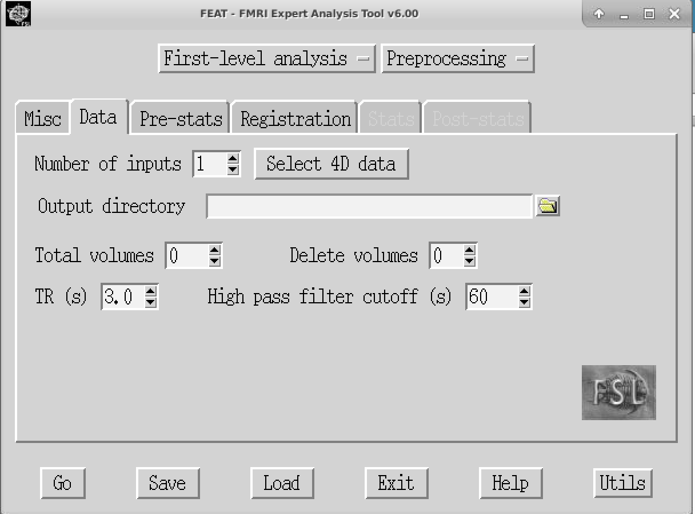
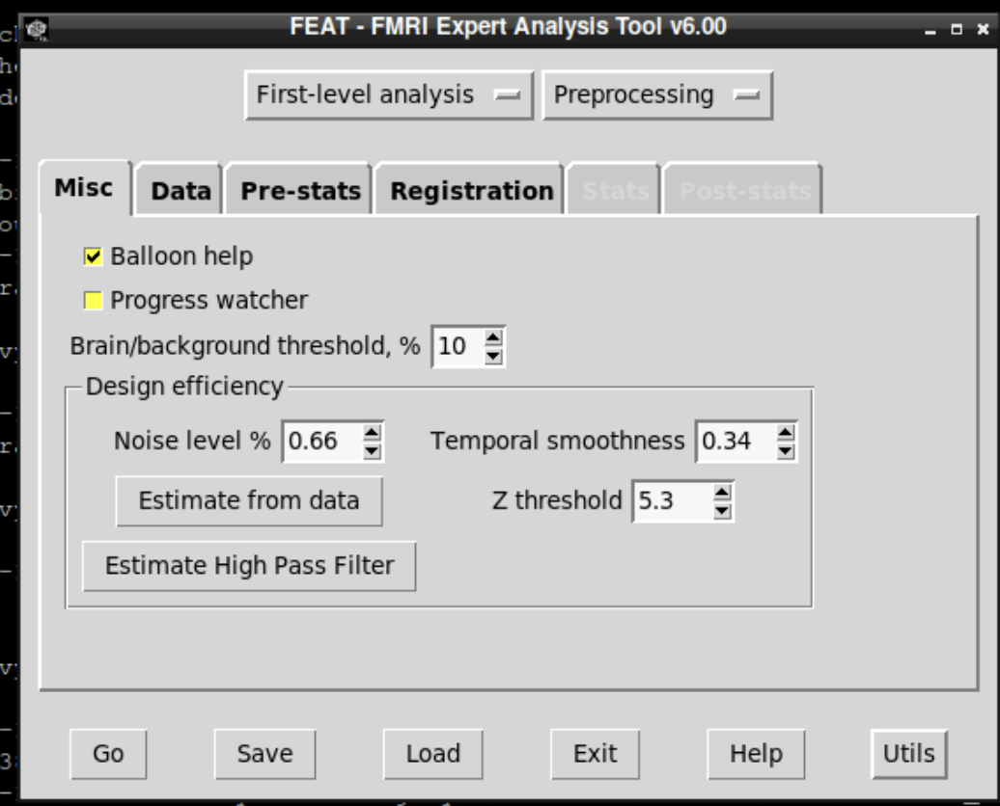
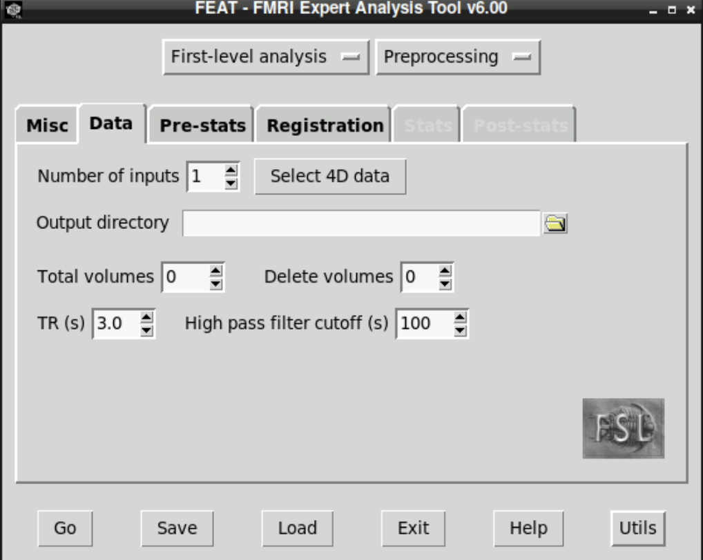
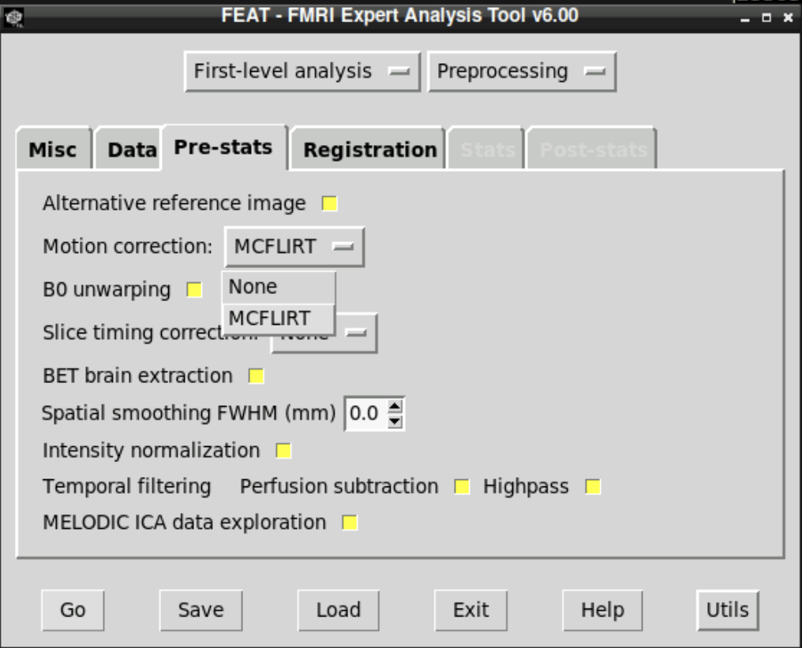
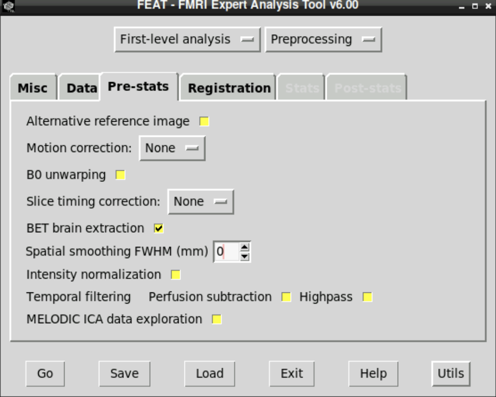
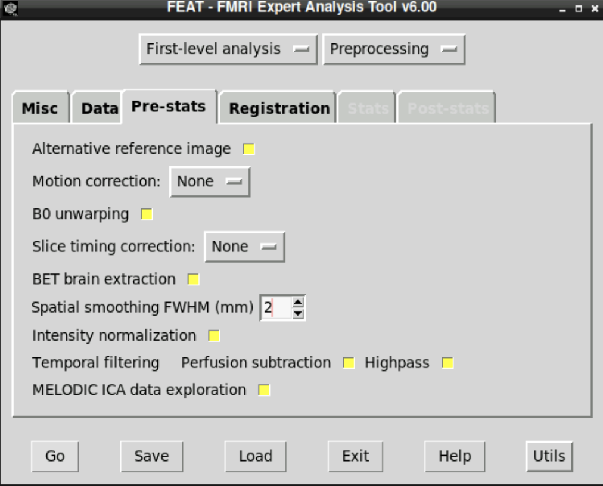
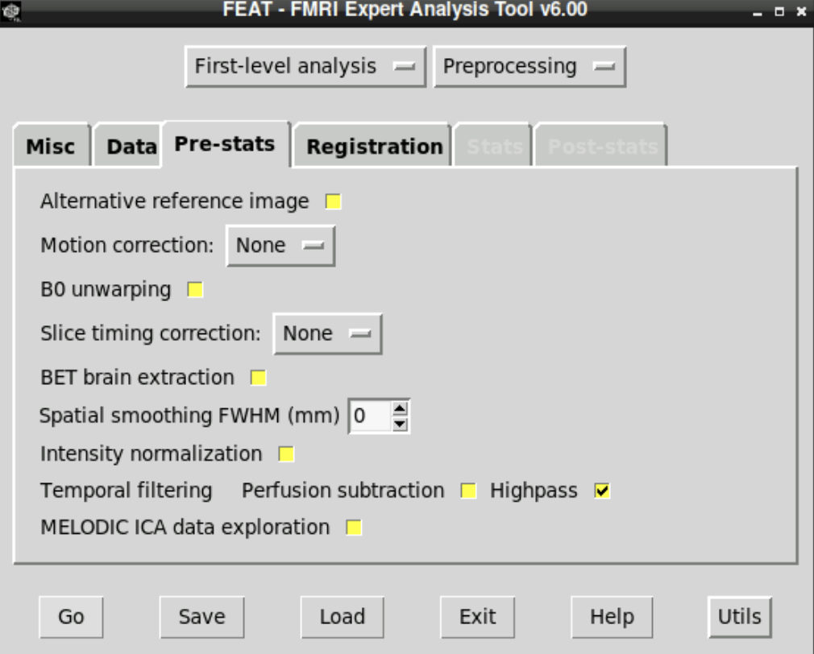
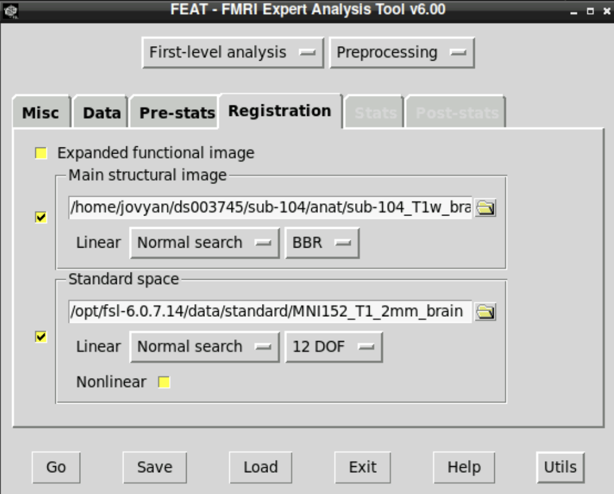

# Lab 2: Preprocessing fMRI data in FSL (FEAT)

## Learning objectives
This lab will help you get comfortable **running and interpreting common fMRI preprocessing steps** using **FEAT** (FSL’s GUI-based pipeline). By the end, you should be able to:

- Open **FEAT** in Neurodesk and configure it for preprocessing-only
- Locate and select functional (4D) and anatomical (3D) files in a BIDS dataset
- Run and interpret key preprocessing steps:
  - quality assurance (visual inspection)
  - motion correction (MCFLIRT)
  - brain extraction (BET)
  - co-registration and normalization to standard (MNI) space
  - spatial smoothing
  - temporal high-pass filtering

> Vocabulary reminder: in fMRI, **TR**, **volume**, **time point**, and **measurement** are often used interchangeably.

---

## Introduction
In lecture, we framed preprocessing as a practical response to a basic reality: **task-related BOLD effects are small** (often a few percent or less), while non-task variability (motion, slow drift, distortions, physiological noise) can be comparable or larger. Preprocessing aims to reduce or remove these non-task sources of variability *before* statistical modeling.

In this lab, you will run FEAT multiple times, enabling **one** preprocessing step per run. That “one-change-at-a-time” approach makes it easier to see what each step is doing, and it encourages good habits around **QC** (quality control).

---

## Before you begin

### Data and outputs (paths)
- **Dataset (read-only):** `~/ds003745/`
- **Your lab output folder (you create this):** `~/Lab_2/OUTPUT/`

Create your output folder:

```bash
mkdir -p ~/Lab_2/OUTPUT
```

**Important:** Do not write outputs into the dataset directory (`~/ds003745/`). Save everything for this lab into `~/Lab_2/OUTPUT/`.

### Make sure FSL is available in your terminal
You have two common ways to run FSL tools in Neurodesk:

**Option A (recommended): use the FSL terminal**
- If you are using the **FSL terminal**, FSL is typically already available.
- You can run commands like `fsleyes`, `bet`, and `Feat` directly.

**Option B: use the base terminal (load the FSL module)**
If you are using the **base terminal**, load FSL first:

```bash
ml fsl
```

Quick sanity check:

```bash
which bet
bet -h | head
```

> Note: In some Neurodesk setups, `$FSLDIR` may be blank even when FSL is working. If `which bet` finds the command, you’re good.

> **At this point, you should begin working on your own.**  
> TAs and the instructor are available for help as needed.

---

# 1) Quick QA: look at the raw data first

Before you preprocess anything, open the raw BOLD run and look for obvious artifacts.

```bash
fsleyes ~/ds003745/sub-104/func/sub-104_task-trust_run-01_bold.nii.gz &
```

As you scroll through time, look for:

- edge effects (large intensity changes at brain boundaries)
- sudden movements (“jumps” in head position)
- signal dropout or distortions (often near sinuses/ear canals)
- regions of high variability (often near the eyes and edges of the brain)

**Q1.** Based on your visual inspection, where does noise/artifact look strongest (e.g., edges, near eyes, ventral frontal regions)? Name **one preprocessing step** from lecture that you expect would help most with the specific issue you noticed.

---

# 2) Start FEAT and configure preprocessing-only

## 2.1 Launch FEAT
To open FEAT, type one of the following in the *FSL terminal*:

- Option A: `fsl &`, then click **FEAT FMRI analysis**
- Option B: `Feat &` (capital **F**)

## 2.2 Set FEAT to preprocessing-only
In FEAT:

1. Set the top-row buttons to:
   - **First-level analysis**
   - **Preprocessing**



2. In the **Misc** tab, decide what you want to do with **Progress Watcher**:
   - **Leave it on (recommended):** FEAT will automatically open the HTML report when it finishes.
   - **Turn it off:** fewer pop-ups, but you’ll need to open the report manually from your `.feat` folder.



**Q2.** When you switch FEAT to preprocessing-only, which modeling/reporting options become unavailable? Name one practical reason you might want preprocessing in a separate FEAT run from statistical modeling.

---

# 3) Select your functional data

Go to the **Data** tab and set:

- **Number of inputs:** 1
- **Select 4D data:** `~/ds003745/sub-104/func/sub-104_task-trust_run-01_bold.nii.gz`
- **Output directory:** `~/Lab_2/OUTPUT`



**Q3.** After you select the 4D BOLD file, FEAT detects **Total volumes** and **TR**. What values does FEAT report? Based on those values, what is the total scan duration (in minutes)?

> Optional note: Slice timing correction is also in the **Pre-stats** tab. Different pipelines handle this differently (or omit it), but the conceptual motivation is the same: slices are not acquired simultaneously.

---

# 4) One-time setup: skull-strip the anatomical image (for registration)

Later, FEAT will register functional data to the structural image and then to standard space. Create a skull-stripped T1w image once, then reuse it for every FEAT run.

```bash
bet ~/ds003745/sub-104/anat/sub-104_T1w.nii.gz ~/Lab_2/OUTPUT/sub-104_T1w_brain
```

(If you prefer the GUI: run `Bet &` in the *FSL terminal* and choose the same input/output.)

---

# 5) Run preprocessing steps one at a time

## 5.1 Workflow you will repeat
For **each** preprocessing step below:

1. In the **Data** tab, set a new **Output name** (so runs do not overwrite each other).  
   Example naming scheme:
   - `sub-104_run-01_mcflirt`
   - `sub-104_run-01_betfunc`
   - `sub-104_run-01_smooth5`
   - `sub-104_run-01_highpass`
   - `sub-104_run-01_reg`
2. In the **Pre-stats** tab, turn **off** all options, then enable **only** the option for the step you are testing.
3. In the **Registration** tab, set:
   - **Main structural:** `~/Lab_2/OUTPUT/sub-104_T1w_brain.nii.gz` (or `.nii`, depending on your output)
   - **Standard:** keep the default (MNI template)
4. Click **Go**.

After FEAT finishes, open this file from your `.feat` directory:

- `filtered_func_data.nii.gz`

A convenient workflow is to keep one `fsleyes` window open for the raw BOLD file and open each FEAT output in a second window for comparison.

---

## 5.2 Motion correction (MCFLIRT)
In **Pre-stats**, enable **only** **Motion correction (MCFLIRT)**.



**Q4.** Compare the raw BOLD data to the MCFLIRT output in `fsleyes` (scroll through volumes). Focus on tissue boundaries (brain edge, ventricles). What changed after correction? Based on the visual evidence, does it look like MCFLIRT did a reasonable job?

---

## 5.3 Brain extraction on the functional (BET)
In **Pre-stats**, enable **only** **BET brain extraction**.



**Q5.** Compare the raw BOLD data to the BET output. Does the output look over-stripped (missing brain tissue), under-stripped (non-brain tissue retained), or reasonable? Name one downstream consequence of poor brain extraction.

---

## 5.4 Spatial smoothing
In **Pre-stats**, enable **only** **Spatial smoothing**. Run three separate FEAT jobs with different kernels:

- **2 mm**
- **5 mm**
- **15 mm**



**Q6.** Compare the smoothing outputs to each other and to the raw data. What changes as the kernel increases? Describe what you see in (i) anatomical detail and (ii) apparent noise. Based on lecture, why can smoothing increase SNR, and what does it cost?

---

## 5.5 Temporal filtering (high-pass)
In **Pre-stats**, enable **only** the **Highpass** option under **Temporal filtering** (use the default cutoff unless instructed otherwise).



**Q7.** Compare the raw data to the high-pass filtered output using the time-series view in `fsleyes`. What kind of variability is reduced by high-pass filtering (think: slow drift), and what risk would an overly aggressive high-pass filter create?

---

## 5.6 Co-registration and normalization (registration report)
For this step, you can leave all **Pre-stats** options off and focus on the **Registration** tab. Confirm:

- **Main structural:** `~/Lab_2/OUTPUT/sub-104_T1w_brain.nii.gz`
- **Standard:** the default MNI template (MNI152)



Run FEAT. Then open the registration report:

- `~/Lab_2/OUTPUT/<your_output_name>.feat/report_reg.html`


In the report, check whether boundaries and internal structures line up across:

- functional → structural
- structural → standard (MNI)

**Q8.** Does your registration look reasonable? Give one specific example from the report (e.g., brain edge alignment, ventricle alignment). What changes when you use the non–skull-stripped structural image for registration?

---

# 6) Optional: command-line utilities (FSLUTILS)

Work in a scratch folder so you do not clutter your outputs:

```bash
mkdir -p ~/Lab_2/OUTPUT/fslutils
cd ~/Lab_2/OUTPUT/fslutils
```

## 6.1 `fslstats`

```bash
fslstats ~/ds003745/sub-104/anat/sub-104_T1w.nii.gz -R -r
fslstats ~/ds003745/sub-104/anat/sub-104_T1w.nii.gz -m -M
```

## 6.2 `fslsplit`

```bash
fslsplit ~/ds003745/sub-104/func/sub-104_task-trust_run-01_bold.nii.gz vol
ls vol*
```

## 6.3 `fslmaths`

```bash
fslmaths vol0121 -sub vol0077 imdiff
fslmaths imdiff -div vol0121 -mul 100 imdiffpercent
```

Open `imdiff` and `imdiffpercent` in `fsleyes` to see where large changes occur.

---

# Question checklist (Q1–Q8)

To make sure nothing gets missed, here is the complete set of questions you should answer in your submission:

- **Q1.** Visual QA: Where does artifact/noise look strongest, and which preprocessing step should help most?
- **Q2.** FEAT mode: What becomes unavailable in preprocessing-only mode, and why separate preprocessing from modeling?
- **Q3.** TR and volumes: What does FEAT detect, and what is the total scan duration?
- **Q4.** MCFLIRT: What changed, and does motion correction look reasonable based on tissue boundaries?
- **Q5.** BET (functional): Over-/under-stripping judgment and one downstream consequence.
- **Q6.** Smoothing: How do 2/5/15 mm kernels change detail and noise; why SNR can improve; what it costs.
- **Q7.** High-pass: What variability is reduced and what is the risk of filtering too aggressively?
- **Q8.** Registration QC: One specific alignment example and the effect of skull stripping.

---

# What to submit
Submit a document with your answers to **Q1–Q8**. Short answers are fine, but they should be specific enough that someone else could follow your reasoning.
