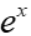

# Lab 2: Understanding Contrast 

***This week\'s exercises will illustrate the principle of* contrast
*and how it relates to pulse sequences.***

The text (Chapter 5) and lecture discussed the idea that MR images can
be acquired with different forms of contrast. You will learn about how
specific pulse sequence values relate to specific types of images.

**This exercise uses anatomical images downloaded in the last lab within your Neurodesk directory
`~/ds003745/sub-104/anat` and
`~/ds003745/sub-137/anat`** 
This dataset consists of four
high-resolution anatomical volumes. The T1w and T2w images were acquired
axially and are sensitive to the contrasts their names denote.
Functional data from the same subject is given in the \"/func\"
directory, for reference. Detailed information about these images is in
the \".json\" files in that same directory.

## Exercise 1: Loading and Analyzing the data
### 1.1 Loading the MRI data

Load all four datasets to fsleyes in *FSL terminal*
**fsleyes** command.

```
fsleyes ~/ds003745/sub-104/anat/sub-104_T1w.nii.gz &
fsleyes ~/ds003745/sub-104/anat/sub-104_T2w.nii.gz &
```

You can also take a look at sub-137. Take some time to notice any
anatomical differences. One is significantly older than the other. Can
you guess which is older/younger?

```
fsleyes ~/ds003745/sub-137/anat/sub-137_T1w.nii.gz & 
fsleyes ~/ds003745/sub-137/anat/sub-137_T2w.nii.gz &
```

### 1.2 Display the MRI data

Display each of the four datasets in a separate **fslview** window.

**Q1: Look at the different axial images (T1, T2). What is similar about
the data?**

**Q2. What is different about the data?**


**At this point, you should begin working on your own.**

**The TAs or instructor will be available for help as needed.**

## Exercise 2: Quantifying the datasets

### 2.1 Recording values of each tissue type 

Using **fslview_deprecated**, select voxels in each
**sub-104_T1w.nii.gz** & **sub-104_T2w.nii.gz** image for each tissue
type (or substance) listed in the chart in the answer section for Q3.
Roughly estimate the range of intensity values for each type in each
image, and enter that range in the chart.

**Q3. should be filled out on the answer key at the end of the
laboratory.**
| **Image**  | **White Matter** |  **Gray Matter** |    **CSF**     |  **Skull**       |   **Air**     |
| :--------- | :--------------: | ---------------: |:--------------:| :--------------: | -------------:|
|  **T1**    |                  |                  |                |                  |               |
|  **T2**    |                  |                  |                |                  |               |


**Q4. The values of gray matter, white matter, etc., change from image
type to image type. But, the values for air outside the skull do not
change appreciably. Why is that?**

## Exercise 3: Calculating Image Contrast

The table below provides approximate values for T1 and T2 of different tissue types. We'll use these values in this exercise, but please treat them as rough guidelines because the exact numbers can vary somewhat.

  -------------------------- ------------------------ ------------------------
 |  **Tissue**              |   **T1 (ms)**          |      **T2 (ms)**       |
 | :----------------------- | :--------------------: | ---------------------: |
 |            CSF           |          2400ms        |          200ms         |
 |        White matter      |           600ms        |            80ms        | 
 |         Gray matter      |          900ms         |         100ms          |
  -------------------------- ------------------------ ------------------------

### 3.1 Basic properties of pulse sequences

**Q5. What does the abbreviation TR stand for? It is the time between two events in a pulse sequence: what are those two events?**

**Q6. Why is TR typically expressed in seconds? What time constant is most associated with TR (i.e. T1 or T2)?**

**Q7. What does the abbreviation *TE* stand for? It is the time between two events in a pulse sequence: what are those two events?**

**Q8. Why is TE typically expressed in milliseconds? What time constant is most associated with TE (i.e. T1 or T2)?**

#### 3.2 T1w Imaging

T1 images are intended to measure *only* differences between tissues in the rate at which the longitudinal magnetization recovers. Look at Figure 5.5 in your textbook.

These data are in BIDS format and so meta data like TR and TE are found in the \"json sidecar files\" 

**Q9. Use `gedit ~/ds003745/sub-104/anat/sub-104_T1w.json &` *based terminal* and fill out the following information**

TR: \_\_\_\_\_\_\_\_, TE \_\_\_\_\_\_\_

**Q10. Why does using a short TR and a short TE give us images most sensitive to T1 effects? (i.e., why do those parameters minimize T2 effects?)**

Let's set the M~0~ (i.e., the recorded signal) of white matter and of gray matter to 1.0. This is an approximation, but it works for the laboratory.

**mwhite = 1.0; mgray = 1.0;**

Set the M0 of CSF to whatever ratio you determined in exercise 3.1. If you had a ratio of 1.5, for example, use the following. 

**mcsf = 1.5;**

Now, we can calculate how much signal we expect to get from gray matter on a T1 image just by plugging in the values from above. Remember that you need to change the T1 and T2 for each tissue fr.

exp(x)=

E=2.71 (in approximation)

**mxy_gray = mgray \* (1-(2\*exp(-TR / T1_gray)) \* exp(-TE / T2_gray)
mxy_white = mwhite \* (1-(2\*exp(-TR / T1_white)) \* exp(-TE / T2_white)**

**Q11. What *ratio* does this give you for the *relative intensity* of gray and white matter on T1 images? Which should be brighter on T1 images: white matter or gray matter? How well do your answers to the first two questions match the real data?**

**Q12. Is the relative difference in intensity between gray and white matter greater on T1 or T2 images?**


### 3.3 T2w Imaging

T2w images are intended to measure *only* differences between tissues in the rate at which the transverse magnetization decays. Look at Figure 5.8 in your textbook. These data are in BIDS format and so meta data like TR and TE are found in the \"json sidecar files\" 

**Q13. Use `gedit ~/ds003745/sub-104/anat/sub-104_T2w.json &` in a *base terminal* and fill out the following information**
TR: \_\_\_\_\_\_\_\_, TE \_\_\_\_\_\_\_

**Q14. Why does using a long TR and a medium TE give us images most sensitive to T2 effects? (i.e., why do those parameters minimize T1 effects?)**

We can calculate how much signal we expect to get from gray matter on a T2 image just by plugging in the values from above. As in the previous example, you need to change the T1 and T2 for each tissue. 

**mxy_gray = mgray \* (1-(2\*exp(-TR / T1_gray)) \* exp(-TE / T2_gray)
(repeat as before)**

**Q15. What ratio does this give you for the relative intensity of gray and white matter on T2 images? Which should be brighter on T2 images: white matter or gray matter? How well do your answers to the first two questions match the real data?**


**Challenge Question. Why is CSF very bright on T2 images? Calculate the expected brightness of CSF on T2 images and compare your calculation to the real data.** 

# Summary of Exercises

**Q1: Look at the different axial images (T1, T2). What is similar about
the data?**

**Q2. What is different about the data?**

**Q3. Fill out the answer key (see in-text instructions above for
context).**

| **Image**  | **White Matter** |  **Gray Matter** |    **CSF**     |  **Skull**       |   **Air**     |
| :--------- | :--------------: | ---------------: |:--------------:| :--------------: | -------------:|
|  **T1**    |                  |                  |                |                  |               |
|  **T2**    |                  |                  |                |                  |               |

**Q4. The values of gray matter, white matter, etc., change from image
type to image type. But the values for air outside the skull do not
change appreciably. Why is that?**

**Q5 What does the abbreviation [TR]{.underline} stand for? It is the time between two events in a pulse sequence: what are those two events?**

**Q6. Why is TR typically expressed in seconds? What time constant is most associated with TR (i.e. T1w or T2w)?**

**Q7. What does the abbreviation *TE* stand for? It is the time between two events in a pulse sequence: what are those two events?**

**Q8. Why is TE typically expressed in milliseconds? What time constant is most associated with TE (i.e. T1w or T2w)?**

**Q9. Find the TR and TE from the appropriate \_T1w.json sidecar file.**

**TR: \_\_\_\_\_\_\_\_, 
TE: \_\_\_\_\_\_\_**

**Q10. Why does using a short TR and a short TE give us images most sensitive to T1 effects? (i.e., why do those parameters minimize T2 effects?)**

**Q11. What *ratio* does this give you for the *relative intensity* of gray and white matter on T1 images? Which should be brighter on T1 images: white matter or gray matter? How well do your answers to the first two questions match the real data?**

**Q12. Is the relative difference in intensity between gray and white matter greater on T1 or T2 images?**

**Q13. Find the TR and TE from the appropriate \_T1w.json file.**

**TR: \_\_\_\_\_\_\_\_, 
TE: \_\_\_\_\_\_\_**

**Q14. Why does using a long TR and a medium TE give us images most sensitive to T2 effects? (i.e., why do those parameters minimize T1 effects?)**

**Q15. What ratio does this give you for the relative intensity of gray and white matter on T2 images? Which should be brighter on T2 images: white matter or gray matter? How well do your answers to the first two questions match the real data?**

**Challenge Question. Why is CSF very bright on T2 images? Calculate the expected brightness of CSF on T2 images, and compare your calculation to the real data.**
