# Lab 3: First-level statistics in FSL (FEAT)

## Learning objectives
In lecture, we covered core ideas behind the General Linear Model (GLM), the BOLD response, and convolution. In this lab, you will apply those ideas by running **first-level (Level 1 / L1) statistics** in **FSL FEAT**.

By the end, you should be able to:

- Create and use **3-column timing files** to build a design matrix
- Specify **EVs** (explanatory variables) and **contrasts** in FEAT
- Apply (and compare) **multiple-comparisons correction** options in FEAT
- Navigate and interpret the main sections of the **FEAT HTML report**

**Notes and reminders**
- All questions are at the **end** of the document.
- You may work with a partner, but everyone submits their **own** assignment.
- Use the in-class discssion board forum for questions and shared troubleshooting.
- **Your submission must include screenshots** (see “What to submit”).

---

## Before you begin

### Folder structure (outputs)
Keep your work separate from the OpenNeuro datasets. Create a lab output folder:

```bash
mkdir -p ~/Lab_3/OUTPUT
```

### Terminals (Neurodesk)
You will typically use two terminals:

- **Base terminal:** for `datalad`, `git`, and basic shell commands
- **FSL terminal:** for FSL tools (e.g., `bet`, `Feat`, `fsleyes`)

If you are in the base terminal and need FSL, you can often run:

```bash
ml fsl
```

---

## 1) Downloading the example datasets

Today you will work with two OpenNeuro datasets:

- **ds005085 (Sequence Pilot):** event-related design (used for an in-class walkthrough)
- **ds000157 (Food viewing):** block design (you will run this on your own)

### 1.1 Obtain sequence pilot data (event-related design)

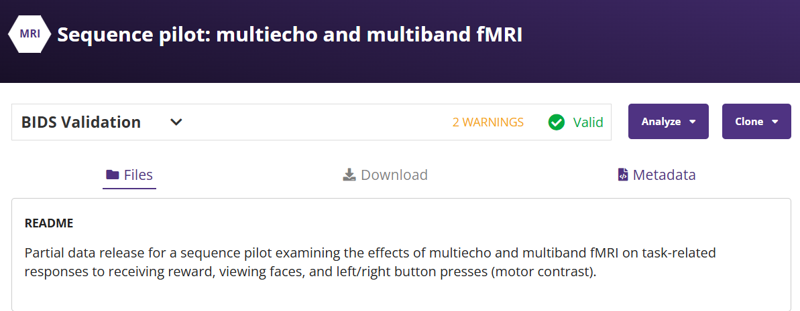

In your **base terminal**:

```bash
cd ~
datalad clone https://github.com/OpenNeuroDatasets/ds005085.git
cd ds005085
datalad get sub-10015
```

Now create a skull-stripped anatomical image (once) in your **FSL terminal**:

```bash
bet ~/ds005085/sub-10015/anat/sub-10015_T1w.nii.gz \
    ~/ds005085/sub-10015/anat/sub-10015_T1w_bet.nii.gz
```

You will also need two timing files (3-column format) for **left** and **right** button presses. Download them onto your Neurodesk VM and move them into:

`~/ds005085/sub-10015/func/`

- [left button press](https://github.com/DVSneuro/2025-fmri-class/blob/main/Utilities/_guess_allLeftButton.txt)
- [right button press](https://github.com/DVSneuro/2025-fmri-class/blob/main/Utilities/_guess_allRightButton.txt)

**Files you will use (sub-10015):**

- **Anatomical:** `~/ds005085/sub-10015/anat/sub-10015_T1w_bet.nii.gz`  
- **BOLD:** `~/ds005085/sub-10015/func/sub-10015_task-sharedreward_acq-mb3me1_bold.nii.gz`  
- **Events:**
  - `~/ds005085/sub-10015/func/_guess_allLeftButton.txt`
  - `~/ds005085/sub-10015/func/_guess_allRightButton.txt`

---

### 1.2 Obtain OpenNeuro food-viewing data (block design)

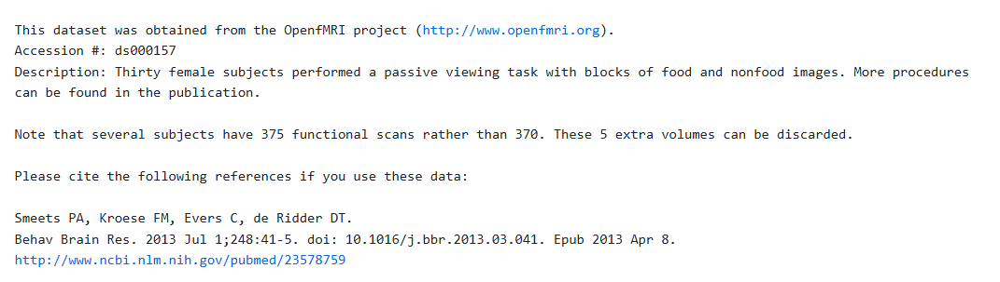

In your **base terminal**:

```bash
cd ~
datalad clone https://github.com/OpenNeuroDatasets/ds000157.git
cd ds000157
datalad get sub-01
```

You will later create 3-column timing files from the BIDS `_events.tsv` file using `BIDSto3col.sh` (Section 4).

---

## 2) Running first-level statistics in FEAT (walkthrough: ds005085)

We will run the sequence pilot dataset together first, then you will run the food-viewing dataset on your own.

### 2.1 Open FEAT

1. In your **FSL terminal**, launch FEAT:
   - `Feat &`

2. At the top of the FEAT window, keep:
   - **First-level analysis**
   - **Full analysis**

3. In the **Misc** tab, you may close **Progress watcher** if you prefer fewer pop-ups.

---

### 2.2 Data tab (inputs + outputs)

- **Select 4D data:**  
  `~/ds005085/sub-10015/func/sub-10015_task-sharedreward_acq-mb3me1_bold.nii.gz`
- **Output directory:**  
  `~/Lab_3/OUTPUT/` (choose a clear output name, e.g., `seqpilot_L1`)

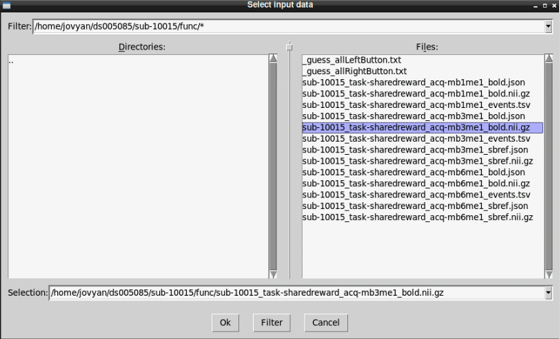

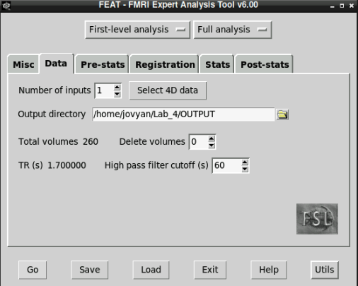

---

### 2.3 Pre-stats tab (preprocessing choices)

This run includes basic preprocessing (similar to Lab 2). Select the following options:

- **Motion correction:** MCFLIRT  
- **Brain extraction:** BET  
- **Spatial smoothing:** 5 mm FWHM  
- **Temporal filtering:** Highpass  
- **Slice timing correction:** Regular down (n-1, n-2, …, 0)

For this dataset, slice timing correction is reasonable because the design is event-related and slices were acquired in a descending order.

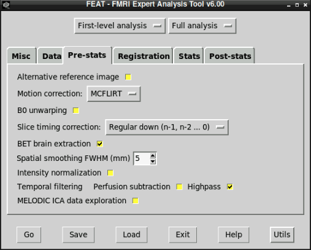

---

### 2.4 Registration tab (functional → structural → standard)

Set the **Main structural image** to:

`~/ds005085/sub-10015/anat/sub-10015_T1w_bet.nii.gz`

Then choose:
- **Normal search**
- **BBR**

Keep the default **Standard space** (typically **MNI152_T1_2mm_brain**, with **12 DOF** linear registration).

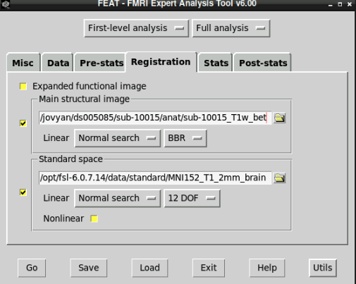

---

### 2.5 Stats tab (EVs + contrasts)

Click **Full model setup** to open the GLM window.

#### A) EV setup
Set **Number of original EVs** to **2**.

**EV1**
- EV name: **Left**
- Basic shape: **Custom (3 column format)**
- Filename: `~/ds005085/sub-10015/func/_guess_allLeftButton.txt`
- Convolution: **Double-Gamma HRF**
- **Turn off**: “Add temporal derivative”
- Keep: “Apply temporal filtering”

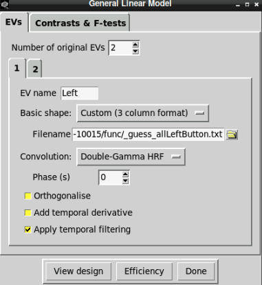

**EV2**
- EV name: **Right**
- Basic shape: **Custom (3 column format)**
- Filename: `~/ds005085/sub-10015/func/_guess_allRightButton.txt`
- Convolution: **Double-Gamma HRF**
- **Turn off**: “Add temporal derivative”
- Keep: “Apply temporal filtering”

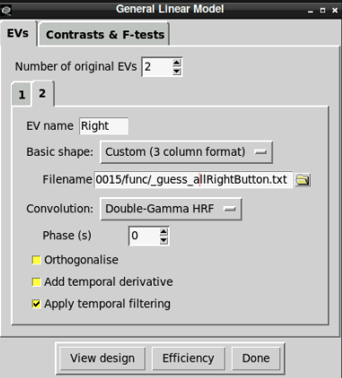

#### B) Contrasts
Go to **Contrasts & F-tests**.

Increase the number of contrasts to **5**. A reasonable set for this dataset is:

| Contrast title | EV1 (Left) | EV2 (Right) |
|---|---:|---:|
| Left (vs baseline) | 1 | 0 |
| Right (vs baseline) | 0 | 1 |
| Left > Right | 1 | -1 |
| Right > Left | -1 | 1 |
| Mean of Left+Right | 1 | 1 |

**Note:** Contrasts with **−1** are difference contrasts (comparisons).

Select **Done**, then close the model-view window when it appears.


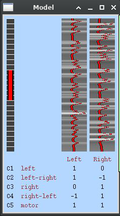

---

### 2.6 Post-stats tab (thresholding + corrections)

Leave the default settings as shown:

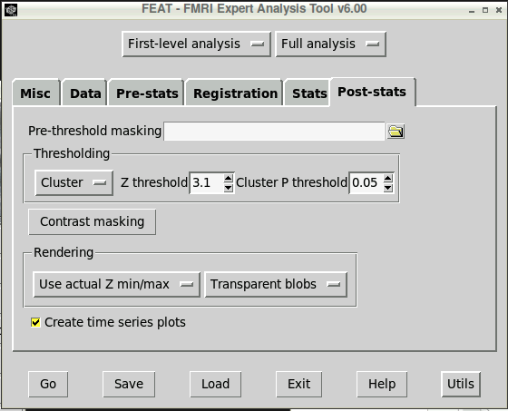

**Important:** The **Thresholding** section is where you choose voxel-based or cluster-based correction.

Click **Go** to run the analysis.

After FEAT starts, open the log/report in your browser (Edge in Neurodesk):

`~/Lab_3/OUTPUT/<your_output_name>.feat/report_log.html`

---

## 3) Viewing and QC’ing the FEAT output (ds005085)

The FEAT report is your primary QC tool. Use it to confirm that the analysis ran correctly and that outputs make sense.

This page summarizes what FEAT ran and where files are stored:

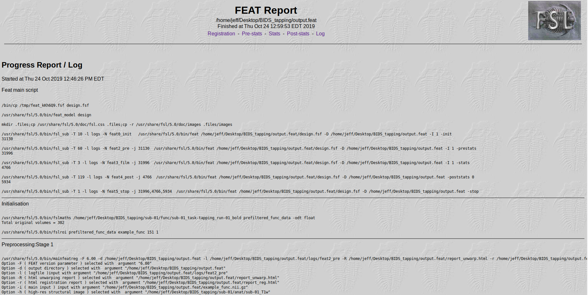

### 3.1 Registration
Check that functional → structural and structural → standard alignment are reasonable and do not cut off large parts of the brain.

Sequence pilot: 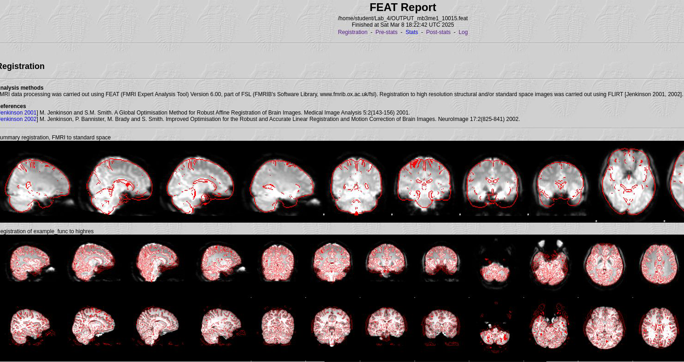

### 3.2 Pre-stats
Review motion estimates (**rotations**, **translations**, **absolute displacement**) for large spikes or sustained drift.

Sequence pilot: 

### 3.3 Stats
Inspect the **design matrix**, **covariance**, and **design efficiency**.

Sequence pilot: 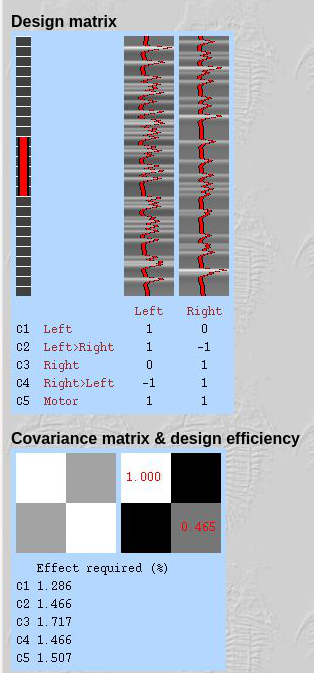

### 3.4 Post-stats
Inspect thresholded activation maps for each contrast. Pay attention to:
- whether activations are neuroanatomically plausible
- how sensitive results are to the thresholding method

Sequence pilot:

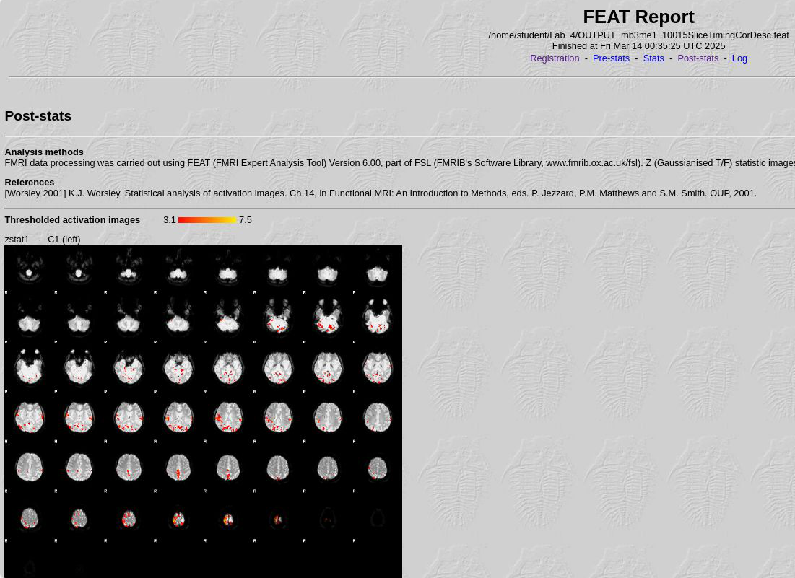

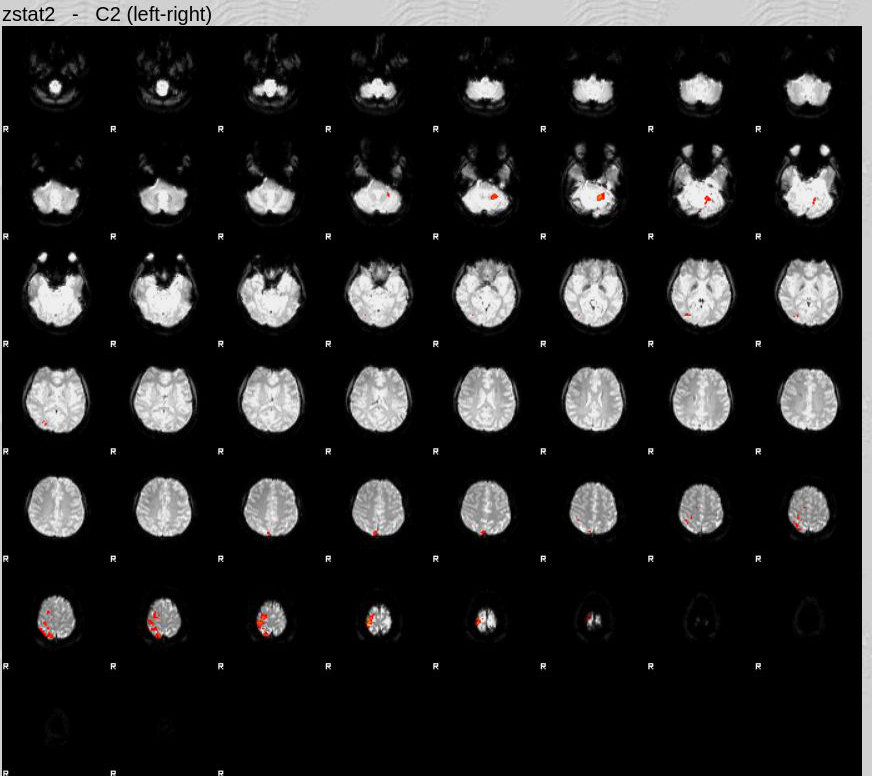

You now have a working template for event-related first-level modeling in FEAT. Next you will run the food-viewing block design (ds000157) on your own.

---

## 4) Create 3-column timing files for ds000157

FSL timing files are **tab-delimited** text files with three columns:

1. onset (seconds)
2. duration (seconds)
3. weight (usually 1)

You need one file per condition.

In your **base terminal**:

```bash
cd ~
git clone http://github.com/bids-standard/bidsutils.git
cd bidsutils/BIDSto3col
bash BIDSto3col.sh  ~/ds000157/sub-01/func/sub-01_task-passiveimageviewing_events.tsv sub-01
```

You should see three files created:

- `sub-01_break.txt`
- `sub-01_food.txt`
- `sub-01_nonfood.txt`

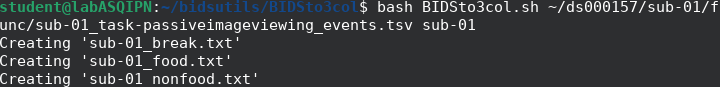

Copy the three files from:

`~/bidsutils/BIDSto3col/`

to:

`~/ds000157/sub-01/func/`

(So you can easily find them when you are in FEAT.)

---

## 5) Run first-level stats for ds000157 (you do this)

Use the ds005085 walkthrough as your template, with these adjustments:

### 5.1 Find the functional input
In a terminal, confirm the BOLD filename:

```bash
ls ~/ds000157/sub-01/func/*bold.nii.gz
```

Select that file in FEAT as your **4D data**.

### 5.2 EVs for ds000157
Use **3 EVs** (custom 3-column format), pointing to:

- `sub-01_break.txt`
- `sub-01_food.txt`
- `sub-01_nonfood.txt`

Use **Double-Gamma HRF** and keep **temporal derivatives off** for consistency with the walkthrough.

### 5.3 Contrasts you will need
At minimum, define these two contrasts (you will use them in the exercises):

- **Food > Nonfood**
- **Nonfood > Food**

You may add others if they help your interpretation (e.g., Food > Break, Nonfood > Break).

### 5.4 Output naming (avoid overwriting)
You will run FEAT multiple times (thresholding, smoothing, misalignment). Use clear output names, e.g.:

- `food_L1_base`
- `food_L1_voxel`
- `food_L1_cluster`
- `food_L1_smooth5`
- `food_L1_smooth10`
- `food_L1_shifted`

---


# Summary of exercises (answer these for ds000157)

For each question, keep your writing tight and evidence-based. A reader should be able to understand what you did and what you observed without guessing.

**Screenshot requirement:** Include screenshots in your submission. Each answer should include at least one relevant screenshot, and you must include **at least 5 screenshots total** across the assignment (see “What to submit”).

1) **Model specification (design + EVs).**  
   After you create the 3-column files for ds000157, set up the FEAT GLM and describe your model at a level appropriate for a Methods section:
   - EV names and what they represent
   - convolution choice
   - key preprocessing choices you used (list them briefly)
   - which contrasts you tested and why  
   *Include a screenshot of the design matrix page from the FEAT report.*

2) **Food vs. nonfood contrasts (interpretation).**  
   Using your **Food > Nonfood** and **Nonfood > Food** contrasts, describe what you see. Focus on:
   - which general systems/regions are involved (no need for perfect labels)
   - whether the pattern seems plausible given the task
   - one alternative explanation or caveat (e.g., visual confounds, attention, threshold sensitivity)  
   *Include at least one thresholded map screenshot (FEAT post-stats page or fsleyes).*

3) **Multiple comparisons: voxel vs. cluster thresholding.**  
   Compare your results under:
   - **voxel height thresholding**, and
   - **cluster-extent thresholding**  
   Keep the rest of the model the same. Describe what changes (e.g., extent, peak intensity, number of clusters).  
   *Include one screenshot for each method (same contrast).*

4) **Smoothing kernels (two choices).**  
   Re-run the model with **two different smoothing kernels** (choose two values that are meaningfully different, e.g., 5 mm vs. 10 mm).  
   Compare how smoothing changes:
   - spatial specificity
   - apparent noise / “blotchiness”
   - the visibility of your main effects  
   *Include one screenshot showing the same contrast under both kernels.*

5) **Temporal misalignment (two ways).**  
   Create a temporal mismatch between your data and your model, then describe what happens to your **Food > Nonfood** (and/or Nonfood > Food) results.

   Use **one** of these approaches, and then briefly explain a second approach (you do not need to run both):
   - **Approach A (shift the timing):** shift onsets in one EV timing file by a constant amount (e.g., +6 seconds), then rerun FEAT.
   - **Approach B (mis-model the HRF):** change the convolution choice (e.g., Double-Gamma → no convolution or a different HRF) and rerun.

   Describe:
   - exactly what you changed
   - how the maps changed (extent/intensity/plausibility)
   - why that change makes sense conceptually  
   *Include a screenshot illustrating the “before vs after” comparison.*

---

## What to submit

Submit **one document** (PDF, Word, or Markdown-exported PDF is fine) containing:

- Answers to questions **1–5**
- **At least 5 screenshots total**, embedded near the relevant answers

Minimum recommended screenshots (you may include more):
1. ds000157 **design matrix** page from the FEAT report
2. ds000157 **registration** page from the FEAT report
3. Food > Nonfood map (one thresholding method)
4. Food > Nonfood map (the other thresholding method)
5. A “before vs after” screenshot for the temporal misalignment manipulation
