# Lab 3 (Supplement): Visualizing FEAT output and using fMRIPrep output in FEAT

This supplement extends Lab 3 in two practical ways. First, it shows how to visualize first-level results more clearly in **FSLEyes** or **MRIcroGL**. Second, it shows how to run **fMRIPrep** on a BIDS dataset and then use the resulting preprocessed BOLD data and confounds in **FEAT**.

We again use **sub-10015** from the sequence pilot dataset that focuses on left/right response (**ds005085**) as the example and expect you to be able to make a short transfer to the other dataset. 

You are not being graded on memorizing flags. You are being graded on whether you can run the pipeline, locate the relevant outputs, and make a simple comparison to the standard FEAT workflow.

---

## Learning objectives

By the end of this supplement, you should be able to:

- run **fMRIPrep** for one participant from a BIDS dataset
- identify the most useful fMRIPrep outputs for first-level modeling in FSL
- use a preprocessed BOLD file and confounds file from fMRIPrep in **FEAT**
- visualize thresholded first-level results on a standardized anatomical background

---

## Before you begin

### 1) Confirm that the dataset exists

In a terminal:

```bash
ls ~/ds005085
ls ~/ds005085/sub-10015
```

### 2) Make sure the needed software is available

Depending on how you opened Neurodesk, these tools may already be available. If not, load the modules directly:

```bash
ml fsl
ml mricrogl
ml fmriprep/25.1.3
```

You can also verify that the commands are available:

```bash
which fsleyes
which MRIcroGL
which fmriprep
```

### 3) FreeSurfer license file

fMRIPrep expects a FreeSurfer license file, even when you use `--fs-no-reconall`.

Check that this file exists:

```bash
ls -l ~/.license
```
If not, look for it in `ds005123_me_demo/licenses` and `mv` it over. 

---

# 1) Run fMRIPrep on the sequence pilot dataset

For consistency with the Lab 2 supplement, the example below keeps the BIDS dataset read-only in spirit and writes outputs to a separate Lab 3 folder.

### 1.1 Set up directories

```bash
#!/usr/bin/env bash
SUB="10015"
BIDS="$HOME/ds005085"
FMRIPREP_OUT="$HOME/Lab_3/fmriprep_out"
WORK="$HOME/Lab_3/fmriprep_work"
FS_LICENSE="$HOME/.license"
FS_dir="$HOME/home/jovyan/freesurfer-subjects-dir"

mkdir -p \
  "$FMRIPREP_OUT" \
  "$WORK" \
  "$HOME/freesurfer-subjects-dir"
```

### 1.2 Load fMRIPrep

```bash
ml fmriprep/25.1.3
```

### 1.3 Run fMRIPrep

```bash
fmriprep \
  "$BIDS" \
  "$FMRIPREP_OUT" \
  participant \
  --participant-label "$SUB" \
  --stop-on-first-crash \
  --skip-bids-validation \
  --output-spaces MNI152NLin6Asym \
  --fs-no-reconall \
  --fs-license-file "$FS_LICENSE" \
  --fs-subjects-dir "$FS_dir" \
  -w "$WORK" \
  --nthreads 14 \
  --omp-nthreads 1 \
  --mem-mb 24000 \
  -v
```

When the run finishes, the most useful outputs for this supplement are:

- the **HTML report**: `~/Lab_3/fmriprep_out/sub-10015.html`
- the **preprocessed BOLD file(s)**: `~/Lab_3/fmriprep_out/sub-10015/func/*desc-preproc_bold.nii.gz`
- the **confounds table(s)**: `~/Lab_3/fmriprep_out/sub-10015/func/*desc-confounds_timeseries.tsv`

---

# 2) Use fMRIPrep output for first-level FEAT analysis

Open the FEAT GUI:

```bash
ml fsl
Feat &
```

Keep the analysis settings as **First-level analysis** and **Full analysis**.

The fMRIPrep-preprocessed functional image you want to use will look something like this:
`fmriprep_out_dir/fmriprep/sub-XX/func/sub-XX_task-XX_run-XX_space-MNI152NLin6Asym_desc-preproc_bold.nii.gz`

In our case of sequence pilot, the preprocessed image is `~/Lab_3/fmriprep_out/sub-10015/func/sub-10015_task-sharedreward_acq-mb3me1_space-MNI152NLin6Asym_desc-preproc_bold.nii.gz`

Under the **Data** tab, load that file with **Select 4D Data**.
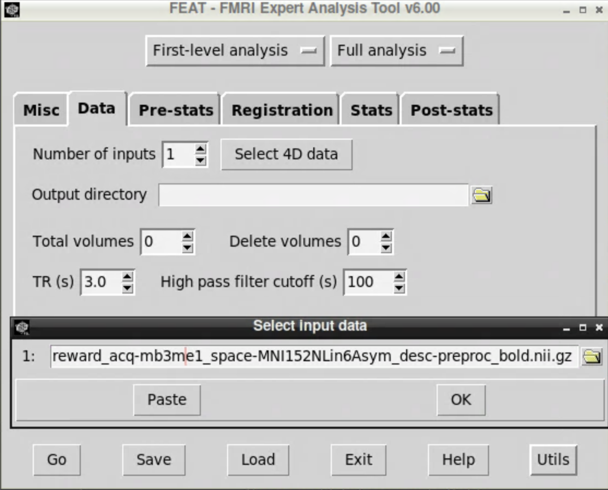

Because fMRIPrep has already handled most preprocessing, the only preprocessing step you still need to apply in FEAT here is **smoothing**.

**Turn off**:
1. all preprocessing options **except smoothing** in the **Pre-stats** tab, and
2. all options in the **Registration** tab.
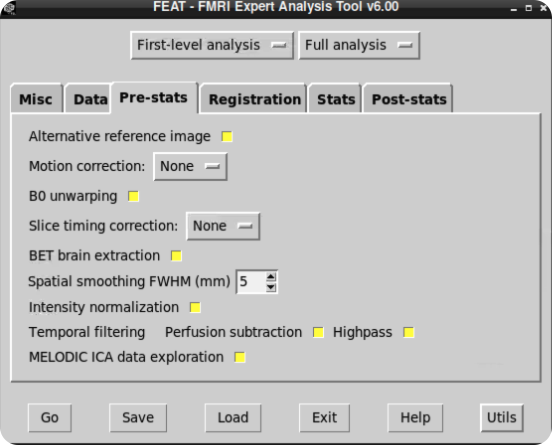

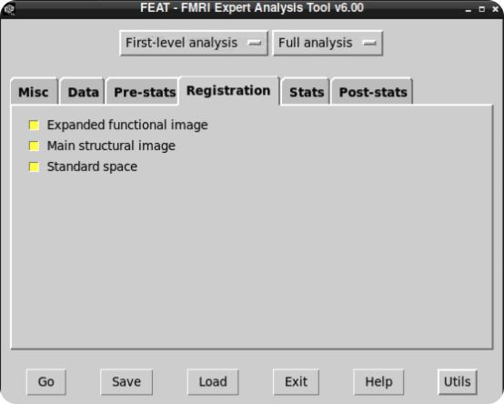

---

# 3) Extract basic confounds from the fMRIPrep TSV

One advantage of fMRIPrep is that it provides confounds you can add to your first-level model. For this example, we will keep things simple and extract:

- the six rigid-body motion parameters: `trans_x`, `trans_y`, `trans_z`, `rot_x`, `rot_y`, `rot_z`
- the first six cosine regressors for slow drift
- the non-steady-state regressor(s)
  
A simple Python approach is usually the least error-prone.

```python
import pandas as pd
from pathlib import Path

sub = "10015"
task = "sharedreward"

func_dir = Path.home() / "Lab_3" / "fmriprep_out" / f"sub-{sub}" / "func"
input_tsv = func_dir / f"sub-{sub}_task-{task}_acq-mb3me1_desc-confounds_timeseries.tsv"


out_dir = Path.home() / "Lab_3" / "confounds"
out_dir.mkdir(parents=True, exist_ok=True)
out_file = out_dir / f"sub-{sub}_task-{task}_desc-fslConfounds.txt"

confounds = pd.read_csv(input_tsv, sep="\t")

motion_cols = ["trans_x", "trans_y", "trans_z", "rot_x", "rot_y", "rot_z"]
cosine_cols = [c for c in confounds.columns if c.startswith("cosine")][:6]
selected = confounds[motion_cols + cosine_cols + ["non_steady_state_outlier00"]]

selected.to_csv(out_file, sep=" ", index=False, header=False)
print(f"Confounds saved to: {out_file}")
```

If you prefer a shell-based approach, this version does the same thing:

```bash
#!/usr/bin/env bash

SUB="10015"
TASK="sharedreward"
FUNC_DIR="$HOME/Lab_3/fmriprep_out/sub-${SUB}/func"
INPUT_TSV="$FUNC_DIR/sub-${SUB}_task-${TASK}_acq-mb3me1_desc-confounds_timeseries.tsv"
OUTDIR="$HOME/Lab_3/confounds"
OUTFILE="$OUTDIR/sub-${SUB}_task-${TASK}_desc-fslConfounds.txt"

mkdir -p "$OUTDIR"

python - <<PY
import pandas as pd
from pathlib import Path

input_tsv = Path("$INPUT_TSV")
out_file = Path("$OUTFILE")

confounds = pd.read_csv(input_tsv, sep="\t")
motion_cols = ["trans_x", "trans_y", "trans_z", "rot_x", "rot_y", "rot_z"]
cosine_cols = [c for c in confounds.columns if c.startswith("cosine")][:6]
selected = confounds[motion_cols + cosine_cols + ["non_steady_state_outlier00"]]
selected.to_csv(out_file, sep=" ", index=False, header=False)
print(f"Confounds saved to: {out_file}")
PY
```

To add the confounds file you just created to the model, tick the box for **Add additional confound EVs** and select that file.
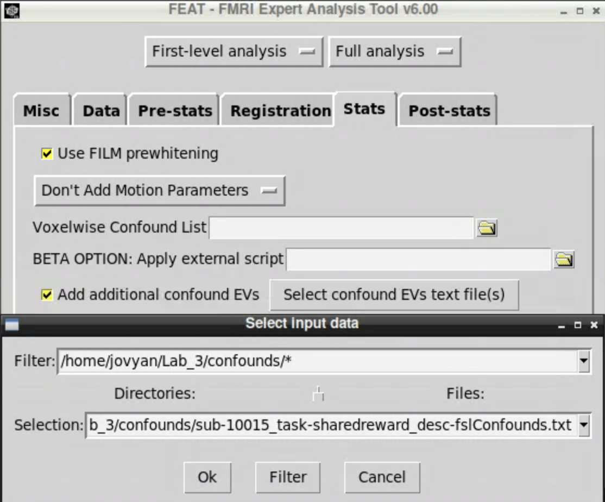

Then finish the rest of the first-level setup as usual. After you finish, your design matrix should look something like this:
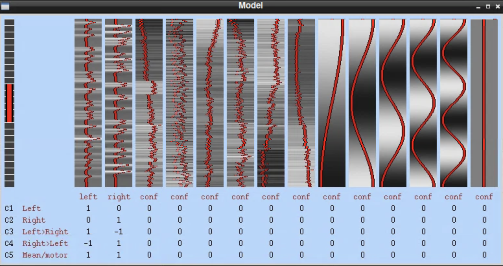

# 4) Visualization with FSLEyes

Open FSLEyes:

```bash
ml fsl
fsleyes
```

Manually add a high-resolution anatomical background image. Here, `MNI_T1_2mm.nii.gz` is used.

Then add the statistical image you want to visualize.
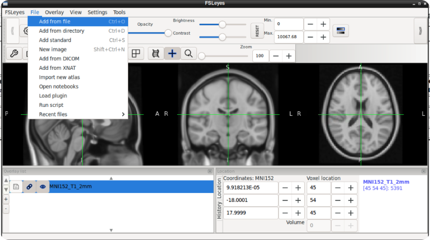

For example, if you want to visualize activation from the **second contrast (left-right)**, the image to overlay would be `thresh_zstat2.nii.gz` from your FEAT output folder.
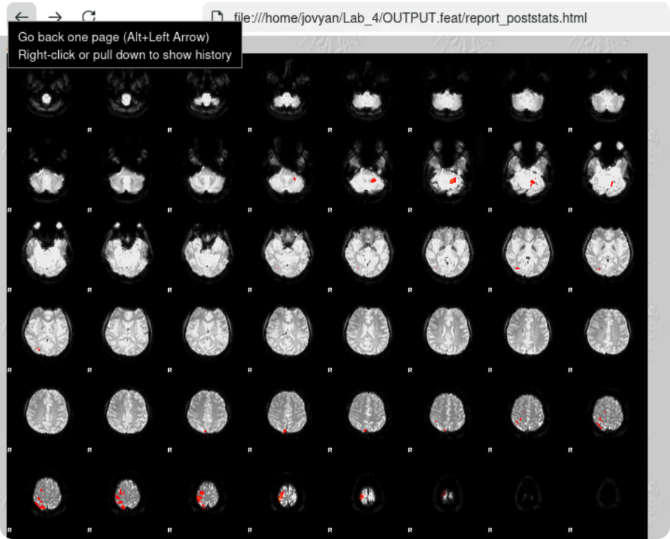

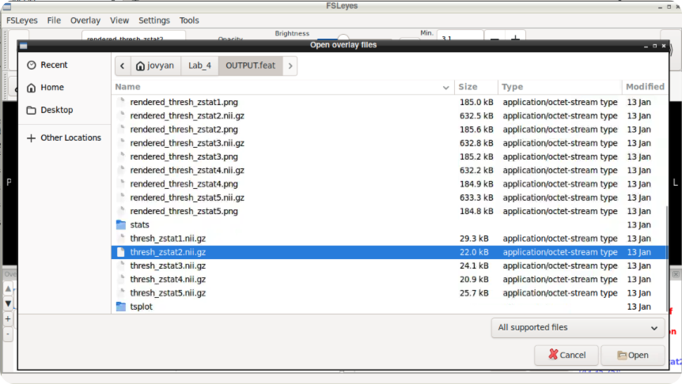

Using the activation shown in your FEAT report as a guide, navigate to the relevant cluster in the brain. Set the minimum display value to **3.1**. Because this is a cluster-corrected result with a cluster-forming threshold of **z = 3.1**, the thresholded Z-statistic image should begin at that value.

To make the result easier to see, adjust the lower and upper display bounds using the greyscale bars on the right. Here, the **Hot** color map is used because it is common in figures.
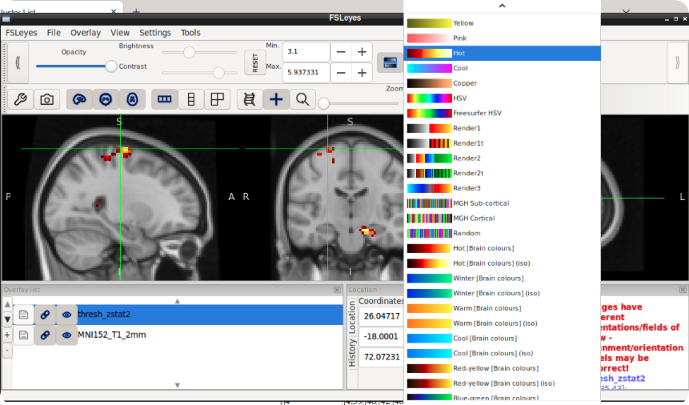

---

# 5) Visualization with MRIcroGL

**MRIcroGL** is an alternative to FSLEyes that can produce cleaner, publication-style figures.

```bash
# in your base terminal
ml mricrogl
MRIcroGL
```

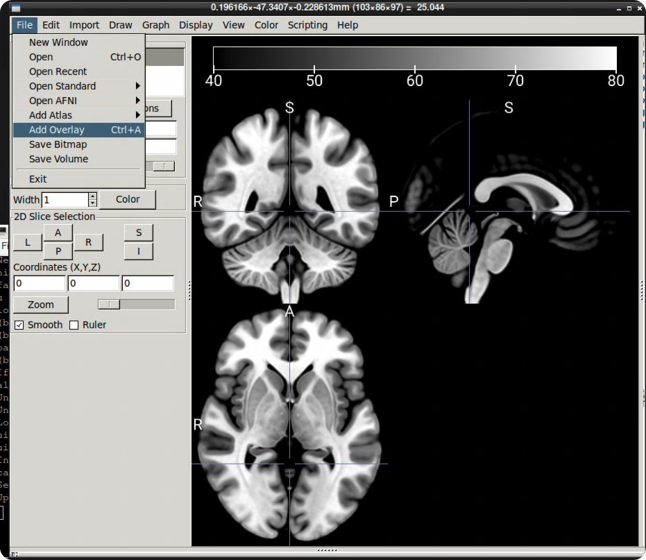

Once **MRIcroGL** opens, a standardized anatomical image is already displayed, so you only need to add the statistical overlay.

Click **File -> Add Overlay** and locate the image you want to display.
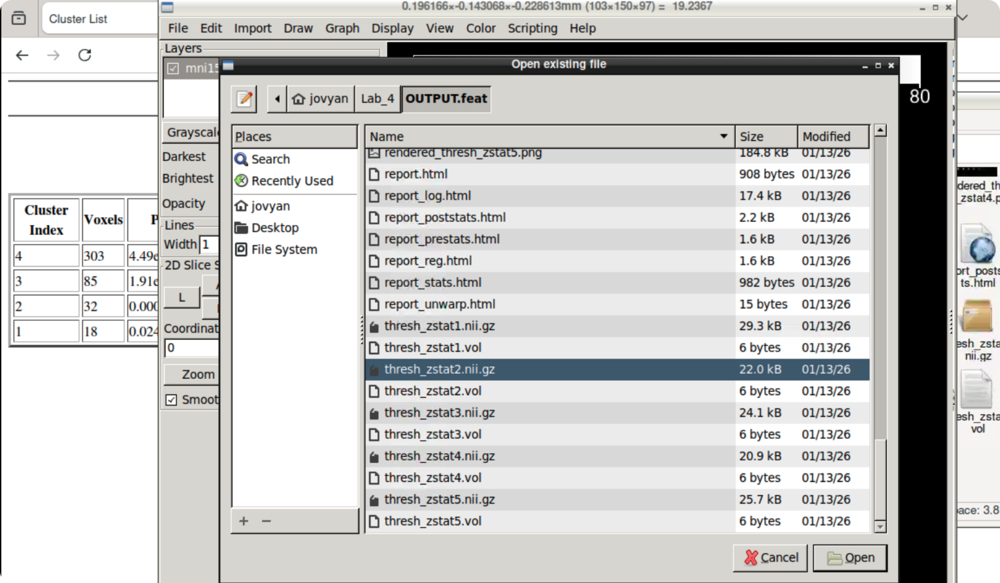

Here, the color map is again changed to **4hot**, and the **Darkest threshold** is changed to **3.1**.

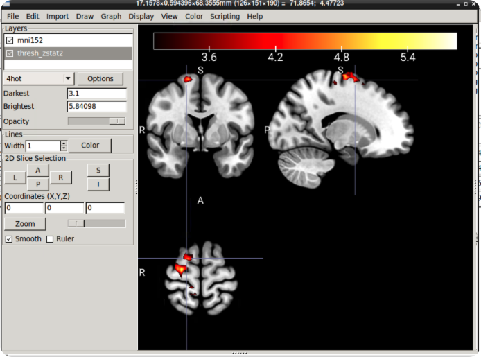

---

## What to submit (keep it simple)

Work through on food viewing dataset and submit **three screenshots** and **three short bullets**.

### Screenshots

1. **One fMRIPrep screenshot** showing the HTML report or the location of the fMRIPrep outputs you used.
2. **One FEAT screenshot** showing either:
   - the selected fMRIPrep preprocessed BOLD file in the **Data** tab, or
   - the confounds file added as **additional confound EVs**, or
   - the final design matrix.
3. **One visualization screenshot** from either **FSLEyes** or **MRIcroGL** showing your thresholded statistical map overlaid on an anatomical background.
   
### Bullets

- **What was similar?** In 1 sentence, name one thing that was clearly similar between the standard FEAT workflow and the fMRIPrep + FEAT workflow.
- **What was different?** In 1 sentence, name one useful thing that fMRIPrep provided that was not part of the simpler FEAT-only workflow.
- **What did you learn?** In 1 sentence, explain one practical reason a researcher might choose to preprocess with fMRIPrep and then model in FEAT.

---

## Troubleshooting checklist

- **`fmriprep: command not found`**  
  Load the module first: `ml fmriprep/25.1.3`
- **Cannot find the license file**  
  Confirm that `~/.license` exists.
- **Cannot find the confounds TSV**  
  Double-check the subject, task, and run labels in the filename.
- **FEAT cannot read the confounds file**  
  Make sure the exported text file has no header row and uses spaces or tabs between columns.
