# Lab 5: Psychophysiological Interaction (PPI) Analyses and Independent Component Analysis (ICA)

## Learning objectives
In previous labs, you focused on task-dependent activity analyses. In this lab, you will extend that work to **functional connectivity** and **ICA**. By the end, you should be able to:

- create an anatomical mask and extract a seed time series for PPI
- set up and describe a PPI design matrix in FEAT, including task, physiological, and interaction regressors
- understand and interpret the main sections of the FEAT report
- compare the **MELODIC ICA** data-exploration output with the FEAT output

---

## Before you begin
You will work with the same **Sequence Pilot** participant used in Lab 3.

**Subject:** Sequence Pilot sub-10015  
**Anatomical:**  
`~/ds005085/sub-10015/anat/sub-10015_T1w_bet.nii.gz`  
**BOLD:**  
`~/ds005085/sub-10015/func/sub-10015_task-sharedreward_acq-mb3me1_bold.nii.gz`  
**Events:**  
```
~/ds005085/sub-10015/func/_guess_allRightButton.txt  
~/ds005085/sub-10015/func/_guess_allLeftButton.txt  
```

Create a folder for your work:

```bash
mkdir -p ~/Lab_5
cd ~/Lab_5
```

As in the earlier labs, keep your outputs separate from the dataset itself.

---

## 1) Make an anatomical (atlas-based) mask
In your **FSL terminal**, define the Harvard-Oxford cortical atlas path:

```bash
# Set brain atlas path: this path applies if you are using fsl-6.0.7.16.
# Change the folder name accordingly if you are loading an earlier version.
atlas=/opt/fsl-6.0.7.16/data/atlases/HarvardOxford/HarvardOxford-cort-maxprob-thr25-2mm.nii.gz
```

Then open the atlas XML file to identify the index associated with the **Juxtapositional Lobule Cortex** (formerly the supplementary motor area / supplementary motor cortex):

```bash
more /opt/fsl-6.0.7.16/data/atlases/HarvardOxford-Cortical.xml
```

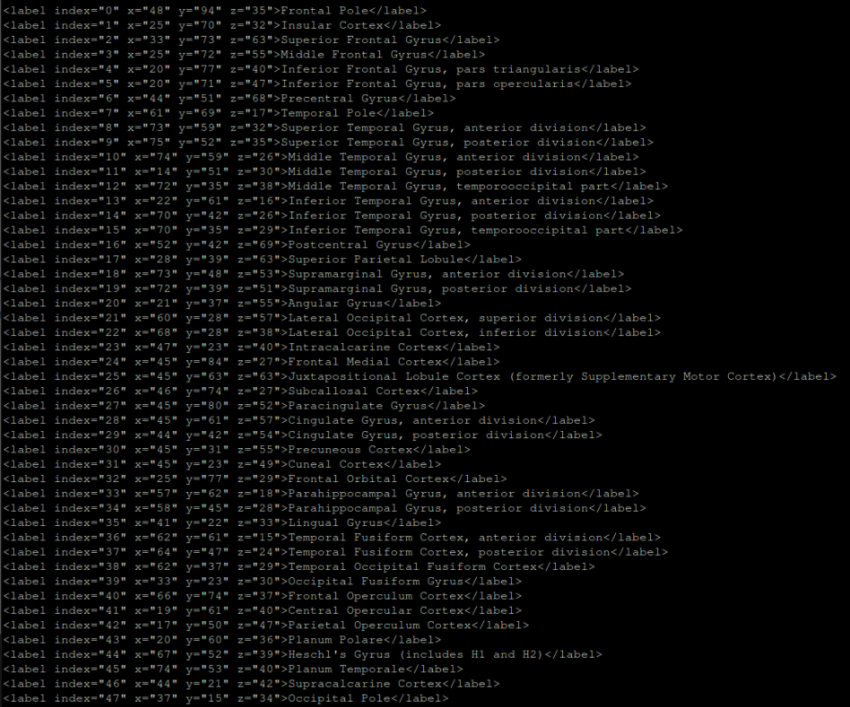

> Note: FSL indexing is generally 0-based. Add 1 to the atlas index to locate the ROI voxel value in the atlas image.

After you identify the correct value, extract the ROI with `fslmaths`:

```bash
# Extract the Juxtapositional Lobule Cortex mask
fslmaths $atlas -thr 26 -uthr 26 -bin JLC

# Use fsleyes to verify the ROI visually
fsleyes JLC.nii.gz &
```

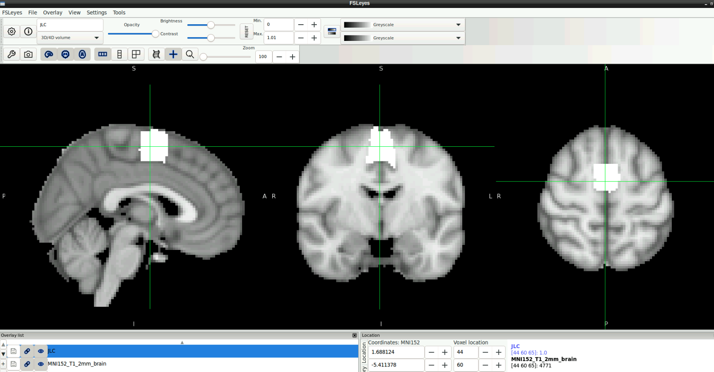

---

## 2) Move the ROI to native space (cf. Lab 3)
Now use `flirt` (**FMRIB’s Linear Image Registration Tool**) to transform the standard-space mask into this subject’s functional space using the transformation matrix from your Lab 3 FEAT output.

> Make sure you replace `YOUR_OUTPUT.feat` with the actual name of your Lab 3 FEAT directory so that FEAT can locate the local-space reference image and the transformation matrix.

In your **FSL terminal**:

```bash
flirt -in JLC.nii.gz \
  -ref ~/Lab_3/YOUR_OUTPUT.feat/example_func.nii.gz \
  -out standardMask2example_func_JLC \
  -applyxfm \
  -init ~/Lab_3/YOUR_OUTPUT.feat/reg/standard2example_func.mat \
  -datatype float
```

Threshold away low-intensity voxels:

```bash
fslmaths standardMask2example_func_JLC -thr 0.5 standardMask2example_func_JLC
```

Then binarize the mask so that voxels inside the ROI are 1 and voxels outside the ROI are 0:

```bash
fslmaths standardMask2example_func_JLC -bin standardMask2example_func_JLC
```

---

## 3) Extract the average signal from the seed region
Use `fslmeants` to extract the mean signal across all voxels in the transformed seed mask for each volume in the functional run:

```bash
fslmeants -i ~/ds005085/sub-10015/func/sub-10015_task-sharedreward_acq-mb3me1_bold.nii.gz \
  -m ~/Lab_5/standardMask2example_func_JLC.nii.gz \
  -o sub-10015_task-sharedreward-task_mb3me1_JLC.txt
```

The output file contains the mean signal from that region at each time point across the run.
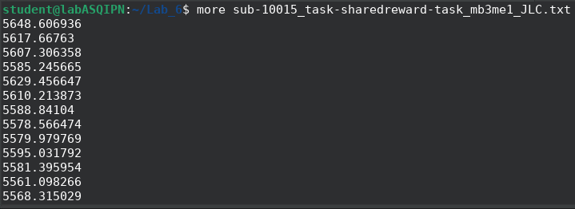

**Note:** You can also use `fslmeants` with masks derived directly from your Level 1 activation results (for example, `cluster_mask_zstat1.nii.gz`) without doing additional normalization or registration. If, for example, you wanted to isolate the second cluster from `cluster_mask_zstat3.nii.gz`, you could run:

```bash
fslmaths cluster_mask_zstat3.nii.gz -thr 2 -uthr 2 cluster2 -bin
```

If that step does not make sense, review your FEAT output and inspect the cluster mask images in **fsleyes**.

---

## 4) Set up the PPI analysis in FEAT

### 4.1 Open FEAT

```bash
Feat &
```

At the top of the FEAT window, keep the default settings:

- **First-level analysis**
- **Full analysis**

### 4.2 Data tab

- Load the BOLD data:  
  `~/ds005085/sub-10015/func/sub-10015_task-sharedreward_acq-mb3me1_bold.nii.gz`
- Set the output directory to: `~/Lab_5/OUTPUT.feat`

---

### 4.3 Pre-stats tab
Select the following preprocessing options:

- **Motion correction:** MCFLIRT
- **Brain extraction:** BET
- **Spatial smoothing:** 5 mm FWHM
- **Temporal filtering:** Highpass
- **MELODIC ICA data exploration:** on

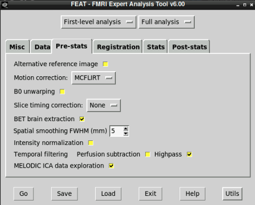


In your `report.html` output, the **Pre-stats** section should include a link to **MELODIC Data Exploration**. Open that link and look through the output. You should see that MELODIC has decomposed the data into components. Some of the spatial maps and time courses may resemble patterns you saw in your GLM results.

### 4.4 Registration tab

- **Structural image:** `~/ds005085/sub-10015/anat/sub-10015_T1w_bet.nii.gz`  
- **Linear registration option:** Use **BBR**
- **Standard space:** Leave the default (`MNI152_T1_2mm_brain`)
- **Standard-space linear options:** Use **Normal search** and **12 DOF**

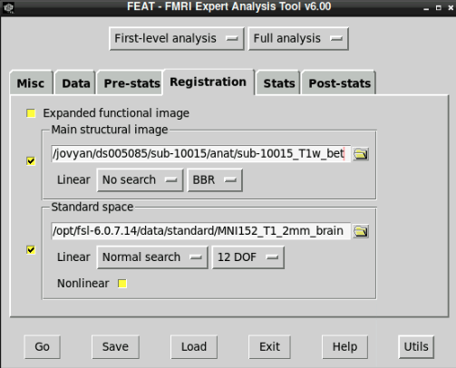

---

### 4.5 Stats tab
Set **Number of EVs** to **5**, then configure them as follows.

1. Click the **EV1** tab and make the following selections:
- **EV name:** Left
- **Basic shape:** Custom (3 column format)
- **Filename:** `~/ds005085/sub-10015/func/_guess_allLeftButton.txt`
- **Convolution:** Double-Gamma HRF
- **Turn off:** “Add temporal derivative”
  
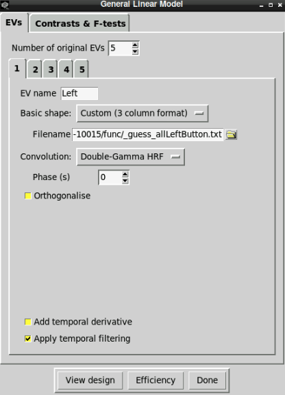


2. Click the **EV2** tab and make the following selections:
- **EV name:** Right
- **Basic shape:** Custom (3 column format)
- **Filename:** `~/ds005085/sub-10015/func/_guess_allRightButton.txt`
- **Convolution:** Double-Gamma HRF
- **Turn off:** “Add temporal derivative”

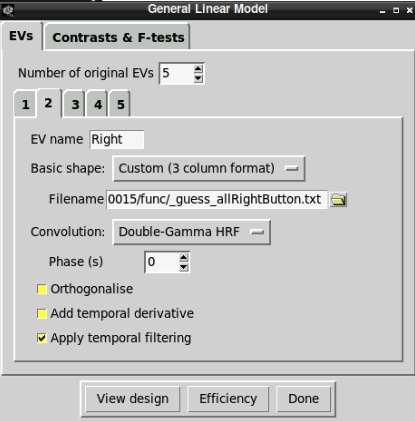

3. Click the **EV3** tab and make the following selections:
- **EV name:** Phys
- **Basic shape:** Custom (1 column entry per volume)
- **Filename:** `~/Lab_5/sub-10015_task-sharedreward-task_mb3me1_JLC.txt`
- **Convolution:** None
- **Turn off:** “Add temporal derivative” and “Apply temporal filtering”

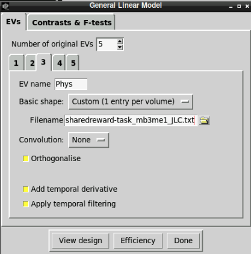

4. Click the **EV4** tab and make the following selections:
- **EV name:** PPI_Left
- **Basic shape:** Interaction
- **Between EVs:** 1 and 3
- **Make zero:** min, min, mean
- **Turn off:** “Add temporal derivative”

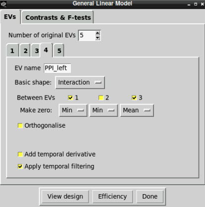

5. Click the **EV5** tab and make the following selections:
- **EV name:** PPI_Right
- **Basic shape:** Interaction
- **Between EVs:** 2 and 3
- **Make zero:** min, min, mean, min
- **Turn off:** “Add temporal derivative”

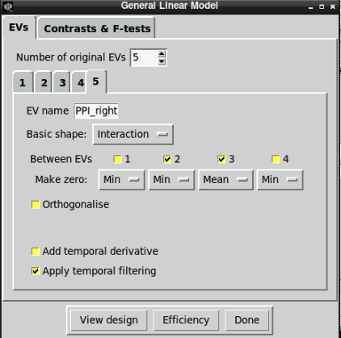

---

### 4.6 Contrasts tab
Set **10 contrasts** and fill them in based on the course materials.

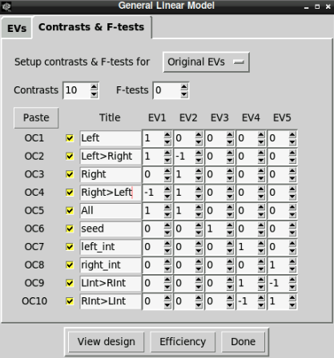

Click **Done**. A window displaying the model should appear. The design matrix should look like this:

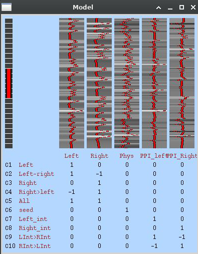

Close the model window when you are finished inspecting it.

## 5) Post-stats tab
Leave the default settings in place. Confirm that your settings match the figure below, then click **Go** in the lower-left corner to run the analysis.

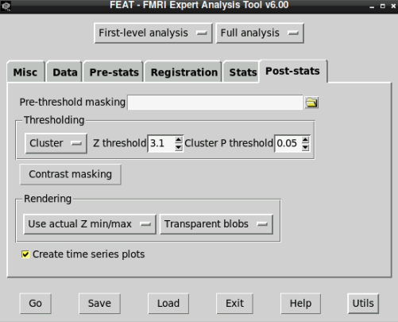

After the run finishes, open the FEAT report:

`~/Lab_5/OUTPUT.feat/report.html`

---

## Lab 5 questions
Answer the following questions in complete sentences.

### Q1
What do you expect to see in the output brain image for the **Phys** regressor (Contrast 6)? Explain your rationale.

### Q2
How would the interpretation of **PPI_Left** and **PPI_Right** change if you removed the **Phys** regressor? How would the interpretation change if you removed the task regressors?

### Q3
Rerun the PPI model with a different seed region. How do the results differ from the SMA/JLC seed, especially for Contrasts 6-10?

### Q4
Compare the **MELODIC ICA** output to the GLM post-stats output. What stands out?

### Q5
How does including a **PPI interaction term** change the interpretation of task effects?
 
### Q6
What are the advantages and limitations of **ICA** compared to the **GLM** in task fMRI?

---

## Question checklist (Q1–Q6)
To make sure nothing gets missed, here is the complete set of questions you should answer in your submission:

- **Q1.** What do you expect to see for the **Phys** regressor, and why?
- **Q2.** How does interpretation change if you remove the **Phys** regressor or the task regressors?
- **Q3.** How do the results change when you use a different seed region?
- **Q4.** What similarities or differences stand out when you compare **MELODIC ICA** and **GLM** outputs?
- **Q5.** How does the **PPI interaction term** change what a task effect means?
- **Q6.** What are the main strengths and limitations of **ICA** relative to the **GLM** in task fMRI?

---

## What to submit
Submit a document with your answers to **Q1–Q6**. Short answers are fine, but they should be specific enough that someone else could follow your reasoning.
